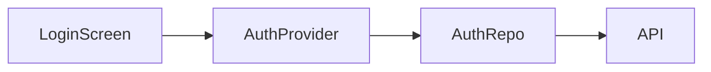

# RIP Flutter App — Surgical Fix Plan (Audit-Based)

> **Audit date**: June 29, 2026  
> **Status**: Structure exists, wiring is completely broken  
> **Approach**: Fix the 3 broken seams — don't rebuild from scratch

---

## What the Audit Confirmed

| Component | Status | Action |
|-----------|--------|--------|
| `RipClient` (Dio, all endpoints) | ✅ Exists, well-structured | Keep, minor fix (explain body key) |
| `command_parser.dart` | ✅ Exists | Verify it covers all commands |
| All widget files | ✅ Exist (tree, mermaid, table, code, etc.) | Keep structure, restyle |
| `chat_provider.dart` | ❌ Only local DB, never calls RipClient | **Rewrite** |
| `response_parser.dart` | ❌ Does not exist | **Create** |
| Design system | ❌ Raw Material defaults, wrong colors | **Create** |
| `withOpacity` deprecations | ⚠️ 19 warnings | Fix all |
| `test/widget_test.dart` | ❌ 1 error (MyApp class name) | Fix |

---

## The 3 Broken Seams (Fix These = App Works)

### Seam 1: ChatProvider never calls the API

**Current broken code** in `chat_provider.dart`:
```dart
Future<void> addUserMessage(String content) async {
  // Adds to local DB. That's it. Never touches RipClient.
  final message = Message(...);
  state = [...state, message];
  await _database.insertMessage(...);
}
```

**Fix**: ChatProvider must inject RipClient, parse the command, call the API, parse the response.

### Seam 2: RipClient.explain() body uses wrong key

**Current** (from audit): sends `{"symbol": topic, "project_id": projectId}`  
**Correct RIP API**: `{"query": topic, "project_id": projectId, "diagram": true, "tree": true, "deps": true}`

Also `listProjects()` returns `Map<String,dynamic>` but should return `List<Project>`.

### Seam 3: No ResponseParser means all responses are raw strings

`RipClient` returns `Map<String,dynamic>` with a `data` key containing raw text/markdown.  
Without `ResponseParser`, everything dumps as plain text → no section cards, no trees, no mermaid.

---

## Exact Files to Create/Rewrite (in order)

### CREATE: `lib/core/design/app_colors.dart`
```dart
import 'package:flutter/material.dart';

abstract final class AppColors {
  // Backgrounds
  static const background     = Color(0xFF0D0D0D);
  static const surface        = Color(0xFF1A1A1A);
  static const surfaceVariant = Color(0xFF242424);
  static const border         = Color(0xFF2A2A2A);
  
  // Brand
  static const primary        = Color(0xFF7C3AED);  // RIP purple
  static const primaryLight   = Color(0xFF9F67FF);
  
  // Status
  static const success        = Color(0xFF22C55E);
  static const warning        = Color(0xFFF59E0B);
  static const error          = Color(0xFFEF4444);
  static const errorSurface   = Color(0xFF2D1515);
  
  // Text
  static const textPrimary    = Color(0xFFF5F5F5);
  static const textSecondary  = Color(0xFF9CA3AF);
  static const textMuted      = Color(0xFF6B7280);
  
  // Icons (per section card type)
  static const iconWorkflow   = Color(0xFF7C3AED);  // purple
  static const iconMermaid    = Color(0xFF06B6D4);  // cyan
  static const iconDeps       = Color(0xFF22C55E);  // green
  static const iconState      = Color(0xFF8B5CF6);  // violet
  static const iconFiles      = Color(0xFFF59E0B);  // amber
  static const iconImpact     = Color(0xFFF59E0B);  // amber
}
```

### CREATE: `lib/core/design/app_theme.dart`
```dart
import 'package:flutter/material.dart';
import 'package:google_fonts/google_fonts.dart';
import 'app_colors.dart';

ThemeData get ripDarkTheme => ThemeData(
  brightness: Brightness.dark,
  scaffoldBackgroundColor: AppColors.background,
  colorScheme: const ColorScheme.dark(
    primary: AppColors.primary,
    surface: AppColors.surface,
    onSurface: AppColors.textPrimary,
    outline: AppColors.border,
  ),
  textTheme: GoogleFonts.interTextTheme(ThemeData.dark().textTheme).copyWith(
    bodyMedium: GoogleFonts.inter(color: AppColors.textPrimary, fontSize: 14),
    bodySmall:  GoogleFonts.inter(color: AppColors.textSecondary, fontSize: 12),
  ),
  appBarTheme: AppBarTheme(
    backgroundColor: AppColors.background,
    elevation: 0,
    titleTextStyle: GoogleFonts.inter(
      color: AppColors.textPrimary, fontSize: 16, fontWeight: FontWeight.w600,
    ),
    iconTheme: const IconThemeData(color: AppColors.textPrimary),
  ),
  inputDecorationTheme: InputDecorationTheme(
    filled: true,
    fillColor: AppColors.surfaceVariant,
    hintStyle: GoogleFonts.inter(color: AppColors.textMuted, fontSize: 14),
    border: OutlineInputBorder(
      borderRadius: BorderRadius.circular(28),
      borderSide: const BorderSide(color: AppColors.border),
    ),
    enabledBorder: OutlineInputBorder(
      borderRadius: BorderRadius.circular(28),
      borderSide: const BorderSide(color: AppColors.border),
    ),
    focusedBorder: OutlineInputBorder(
      borderRadius: BorderRadius.circular(28),
      borderSide: const BorderSide(color: AppColors.primary),
    ),
    contentPadding: const EdgeInsets.symmetric(horizontal: 20, vertical: 14),
  ),
  chipTheme: ChipThemeData(
    backgroundColor: AppColors.surfaceVariant,
    labelStyle: GoogleFonts.inter(color: AppColors.textSecondary, fontSize: 13),
    shape: const StadiumBorder(),
    side: const BorderSide(color: AppColors.border),
  ),
);
```

### REWRITE: `lib/data/models/rip_response.dart` (CREATE NEW)
```dart
enum BlockType { text, workflowTree, mermaid, table, code, fileList, impact, suggestionChips }

enum ImpactSeverity { high, medium, low }

class RipResponseBlock {
  const RipResponseBlock({
    required this.type,
    this.title,
    this.subtitle,
    this.textContent,       // text, mermaid, code blocks
    this.listContent,       // tree nodes, file paths, chip labels
    this.tableHeaders,
    this.tableRows,
    this.count,
    this.language,          // for code blocks
    this.severity,          // for impact block
  });

  final BlockType type;
  final String? title;
  final String? subtitle;
  final String? textContent;
  final List<String>? listContent;
  final List<String>? tableHeaders;
  final List<List<String>>? tableRows;
  final int? count;
  final String? language;
  final ImpactSeverity? severity;
}
```

### CREATE: `lib/utils/response_parser.dart`

This is the most critical missing piece. The RIP `/explain` endpoint returns raw text like:

```
Here's how login works in your application.

## Workflow

LoginScreen → AuthProvider → AuthRepo → API



## Dependencies

| Symbol | Type | File |
|--------|------|------|
| login() | Function | lib/screens/login.dart |

## Files Involved

- lib/screens/login_screen.dart
- lib/providers/auth_provider.dart

## Impact

**Severity**: High
Changes here affect 12 dependent components.
```

The parser must extract each section into typed blocks:

```dart
class ResponseParser {
  static const _mermaidRe = r'```mermaid\n([\s\S]*?)```';
  static const _codeRe    = r'```(\w+)?\n([\s\S]*?)```';
  static const _tableRe   = r'\|(.+)\|\n\|[-| :]+\|\n((?:\|.+\|\n?)+)';
  static const _fileRe    = r'^[-*•]\s*((?:lib|src|test|android|ios)/\S+\.dart)';

  static List<RipResponseBlock> parse(
    String raw, {
    CommandType commandType = CommandType.naturalLang,
    String? symbol,
  }) {
    final blocks = <RipResponseBlock>[];
    var remaining = raw;

    // 1. Extract mermaid blocks
    final mermaidMatches = RegExp(_mermaidRe, multiLine: true).allMatches(remaining);
    for (final m in mermaidMatches) {
      blocks.add(RipResponseBlock(
        type: BlockType.mermaid,
        title: 'Mermaid Diagram',
        subtitle: 'Visual representation of the flow',
        textContent: m.group(1)!.trim(),
      ));
    }
    remaining = remaining.replaceAll(RegExp(_mermaidRe, multiLine: true), '');

    // 2. Extract code blocks
    final codeMatches = RegExp(_codeRe, multiLine: true).allMatches(remaining);
    for (final m in codeMatches) {
      blocks.add(RipResponseBlock(
        type: BlockType.code,
        language: m.group(1) ?? 'text',
        textContent: m.group(2)!.trim(),
      ));
    }
    remaining = remaining.replaceAll(RegExp(_codeRe, multiLine: true), '');

    // 3. Extract markdown tables
    final tableMatches = RegExp(_tableRe, multiLine: true).allMatches(remaining);
    for (final m in tableMatches) {
      final headers = m.group(1)!.split('|').map((s) => s.trim()).where((s) => s.isNotEmpty).toList();
      final rowLines = m.group(2)!.trim().split('\n');
      final rows = rowLines.map((line) =>
        line.split('|').map((s) => s.trim()).where((s) => s.isNotEmpty).toList()
      ).toList();
      blocks.add(RipResponseBlock(
        type: BlockType.table,
        title: 'Dependencies',
        subtitle: 'CALLS relationships in the flow',
        tableHeaders: headers,
        tableRows: rows,
        count: rows.length,
      ));
    }
    remaining = remaining.replaceAll(RegExp(_tableRe, multiLine: true), '');

    // 4. Extract workflow/trace lines (→ chains)
    final workflowLines = remaining
        .split('\n')
        .where((l) => l.contains('→') || l.contains('->'))
        .toList();
    if (workflowLines.isNotEmpty) {
      final nodes = workflowLines.first
          .split(RegExp(r'→|->'))
          .map((s) => s.trim())
          .where((s) => s.isNotEmpty)
          .toList();
      blocks.insert(0, RipResponseBlock(
        type: BlockType.workflowTree,
        title: 'Workflow Tree',
        subtitle: workflowLines.first.trim(),
        listContent: nodes,
        count: nodes.length,
      ));
    }

    // 5. Extract file paths
    final fileMatches = RegExp(_fileRe, multiLine: true).allMatches(remaining);
    final files = fileMatches.map((m) => m.group(1)!).toList();
    if (files.isNotEmpty) {
      blocks.add(RipResponseBlock(
        type: BlockType.fileList,
        title: 'Important Files',
        subtitle: 'Key files involved in ${symbol ?? "this flow"}',
        listContent: files,
        count: files.length,
      ));
    }

    // 6. Detect impact severity
    final severityMatch = RegExp(r'(?:severity|risk)[:\s]+(\w+)', caseSensitive: false).firstMatch(remaining);
    if (severityMatch != null) {
      final sev = severityMatch.group(1)!.toLowerCase();
      blocks.add(RipResponseBlock(
        type: BlockType.impact,
        title: 'Impact Analysis',
        subtitle: 'What will be affected if this changes',
        severity: sev == 'high' ? ImpactSeverity.high
                : sev == 'medium' ? ImpactSeverity.medium
                : ImpactSeverity.low,
      ));
    }

    // 7. Clean remaining text → text block (first)
    final cleanText = remaining
        .replaceAll(RegExp(_fileRe, multiLine: true), '')
        .replaceAll(RegExp(r'\n{3,}'), '\n\n')
        .trim();
    if (cleanText.isNotEmpty) {
      blocks.insert(0, RipResponseBlock(type: BlockType.text, textContent: cleanText));
    }

    // 8. Suggestion chips always last
    blocks.add(RipResponseBlock(
      type: BlockType.suggestionChips,
      listContent: _chipsFor(commandType),
    ));

    return blocks;
  }

  static List<String> _chipsFor(CommandType type) => switch (type) {
    CommandType.explain     => ['Show state flow', 'Show impact', 'Show consumers', 'Find similar'],
    CommandType.trace       => ['Show full chain', 'Show impact', 'What calls this?', 'Find similar'],
    CommandType.impact      => ['Show dependents', 'Trace callers', 'Show metrics'],
    CommandType.search      => ['Explain this', 'Trace this', 'Show impact'],
    CommandType.architecture => ['Show metrics', 'Find dead code', 'Show dependencies'],
    _                       => ['Search', 'Explain', 'Architecture', 'Metrics'],
  };
}
```

### REWRITE: `lib/presentation/providers/chat_provider.dart`

This is the main fix. Current state: local-only. New state: API-routing brain.

```dart
// Key structure — full impl goes in the file
class ChatNotifier extends StateNotifier<List<Message>> {
  ChatNotifier(this._ref, this._db) : super([]) {
    _loadHistory();
  }

  final Ref _ref;
  final AppDatabase _db;

  Future<void> sendMessage(String text) async {
    if (text.trim().isEmpty) return;

    // 1. Parse
    final parsed = CommandParser.parse(text.trim());

    // 2. User message
    final userMsg = Message(
      id: const Uuid().v4(),
      content: text,
      type: MessageType.user,
      timestamp: DateTime.now(),
    );
    state = [...state, userMsg];
    await _db.insertMessage(userMsg);

    // 3. Pending (typing indicator)
    final pendingId = const Uuid().v4();
    final pending = Message(
      id: pendingId,
      content: '',
      type: MessageType.rip,
      timestamp: DateTime.now(),
      isLoading: true,
    );
    state = [...state, pending];

    try {
      // 4. Call API
      final rawResponse = await _executeCommand(parsed);

      // 5. Parse into blocks
      final blocks = ResponseParser.parse(
        rawResponse,
        commandType: parsed.type,
        symbol: parsed.args['symbol'] ?? parsed.args['query'],
      );

      // 6. Replace pending with real message
      final ripMsg = Message(
        id: pendingId,
        content: rawResponse,
        type: MessageType.rip,
        timestamp: DateTime.now(),
        blocks: blocks,
      );
      state = state.map((m) => m.id == pendingId ? ripMsg : m).toList();
      await _db.insertMessage(ripMsg);

    } catch (e) {
      state = state.map((m) => m.id == pendingId
        ? m.copyWith(isLoading: false, error: e.toString())
        : m
      ).toList();
    }
  }

  Future<String> _executeCommand(ParsedCommand cmd) async {
    final client = _ref.read(ripClientProvider);
    final projectId = _ref.read(activeProjectProvider)?.projectId;

    return switch (cmd.type) {
      CommandType.search    => client.search(query: cmd.args['query']!, projectId: projectId).then(_extractText),
      CommandType.explain   => client.explain(query: cmd.args['query']!, projectId: projectId, diagram: true, tree: true, deps: true).then(_extractText),
      CommandType.trace     => client.trace(symbol: cmd.args['symbol']!, projectId: projectId).then(_extractText),
      CommandType.impact    => client.impact(symbol: cmd.args['symbol']!, projectId: projectId).then(_extractText),
      CommandType.architecture => client.architecture(projectId: projectId).then(_extractText),
      CommandType.metrics   => client.metrics(projectId: projectId).then(_extractText),
      CommandType.onboard   => client.onboard(projectId: projectId).then(_extractText),
      CommandType.deadCode  => client.deadCode(projectId: projectId).then(_extractText),
      CommandType.naturalLang => client.explain(query: cmd.raw, projectId: projectId, diagram: true, tree: true, deps: true).then(_extractText),
      _ => Future.value('Command not yet implemented: ${cmd.type.name}'),
    };
  }

  String _extractText(dynamic response) {
    if (response is String) return response;
    if (response is Map) return response['data']?.toString() ?? response.toString();
    return response.toString();
  }
}
```

### FIX: `lib/core/api/rip_client.dart` — correct `explain` body

Current (broken):
```dart
body: {"symbol": topic, "project_id": projectId}
```

Correct:
```dart
body: {
  "query": query,
  if (projectId != null) "project_id": projectId,
  "diagram": diagram,
  "tree": tree,
  "deps": deps,
  "no_llm": false,
}
```

Also fix `listProjects()` to properly deserialize into `List<Project>` from the response `data` array.

### FIX: `test/widget_test.dart`

Change `MyApp` → actual app class name (whatever `app.dart` exports — likely `RipApp`).

### FIX: All `withOpacity()` → `withValues(alpha:)`

Run this find-replace across all dart files:
```
.withOpacity(0.3) → .withValues(alpha: 0.3)
.withOpacity(0.6) → .withValues(alpha: 0.6)
```

---

## Widget Restyling (Structure Stays, Colors Change)

### `lib/presentation/widgets/common/section_card.dart` (CREATE)

The screenshot shows every rich block uses the same card shape. Create this once:

```dart
class SectionCard extends StatefulWidget {
  const SectionCard({
    required this.icon,
    required this.iconColor,
    required this.title,
    required this.subtitle,
    this.trailingLabel,
    this.trailingColor,
    this.child,
    this.initiallyExpanded = false,
    super.key,
  });

  final IconData icon;
  final Color iconColor;
  final String title;
  final String subtitle;
  final String? trailingLabel;    // "8 nodes", "Preview", "High"
  final Color? trailingColor;
  final Widget? child;
  final bool initiallyExpanded;

  @override
  State<SectionCard> createState() => _SectionCardState();
}

class _SectionCardState extends State<SectionCard> {
  late bool _expanded;

  @override
  void initState() {
    super.initState();
    _expanded = widget.initiallyExpanded;
  }

  @override
  Widget build(BuildContext context) {
    return Container(
      margin: const EdgeInsets.symmetric(vertical: 4),
      decoration: BoxDecoration(
        color: AppColors.surface,
        borderRadius: BorderRadius.circular(12),
        border: Border.all(color: AppColors.border),
      ),
      child: Column(
        children: [
          InkWell(
            onTap: widget.child != null ? () => setState(() => _expanded = !_expanded) : null,
            borderRadius: BorderRadius.circular(12),
            child: Padding(
              padding: const EdgeInsets.all(16),
              child: Row(
                children: [
                  Container(
                    width: 36, height: 36,
                    decoration: BoxDecoration(
                      color: widget.iconColor.withValues(alpha: 0.12),
                      borderRadius: BorderRadius.circular(8),
                    ),
                    child: Icon(widget.icon, color: widget.iconColor, size: 18),
                  ),
                  const SizedBox(width: 12),
                  Expanded(
                    child: Column(
                      crossAxisAlignment: CrossAxisAlignment.start,
                      children: [
                        Text(widget.title, style: AppTextStyles.bodyMdBold),
                        Text(widget.subtitle, style: AppTextStyles.bodySmMuted),
                      ],
                    ),
                  ),
                  if (widget.trailingLabel != null) ...[
                    Container(
                      padding: const EdgeInsets.symmetric(horizontal: 8, vertical: 4),
                      decoration: BoxDecoration(
                        color: (widget.trailingColor ?? AppColors.textMuted).withValues(alpha: 0.15),
                        borderRadius: BorderRadius.circular(6),
                      ),
                      child: Text(
                        widget.trailingLabel!,
                        style: AppTextStyles.caption.copyWith(
                          color: widget.trailingColor ?? AppColors.textMuted,
                          fontWeight: FontWeight.w600,
                        ),
                      ),
                    ),
                    const SizedBox(width: 8),
                  ],
                  if (widget.child != null)
                    Icon(
                      _expanded ? Icons.keyboard_arrow_up : Icons.keyboard_arrow_down,
                      color: AppColors.textMuted,
                      size: 20,
                    ),
                ],
              ),
            ),
          ),
          if (_expanded && widget.child != null)
            Padding(
              padding: const EdgeInsets.fromLTRB(16, 0, 16, 16),
              child: widget.child!,
            ),
        ],
      ),
    );
  }
}
```

### Response Block Widgets

Each block widget just wraps `SectionCard` with the right icon/color/content:

```dart
// workflow_tree_block.dart
SectionCard(
  icon: Icons.account_tree_outlined,
  iconColor: AppColors.iconWorkflow,
  title: 'Workflow Tree',
  subtitle: block.subtitle ?? '',
  trailingLabel: '${block.count} nodes',
  child: Column(
    children: block.listContent!.asMap().entries.map((e) =>
      _treeNode(e.key, e.value, total: block.listContent!.length)
    ).toList(),
  ),
)

// mermaid_block.dart
SectionCard(
  icon: Icons.hub_outlined,
  iconColor: AppColors.iconMermaid,
  title: 'Mermaid Diagram',
  subtitle: 'Visual representation of the flow',
  trailingLabel: 'Preview',
  child: WebViewWidget(controller: _controller), // render mermaid
)

// impact_block.dart
SectionCard(
  icon: Icons.bar_chart,
  iconColor: AppColors.iconImpact,
  title: 'Impact Analysis',
  subtitle: 'What will be affected if this changes',
  trailingLabel: block.severity!.name.capitalize(),
  trailingColor: block.severity == ImpactSeverity.high ? AppColors.error : AppColors.warning,
)
```

### Chat Screen Input Bar

Replace current basic `Row` with this layout (matches screenshot):

```dart
SafeArea(
  child: Container(
    padding: const EdgeInsets.fromLTRB(12, 8, 12, 12),
    decoration: BoxDecoration(
      color: AppColors.background,
      border: Border(top: BorderSide(color: AppColors.border)),
    ),
    child: Row(
      children: [
        // + button
        IconButton(
          icon: const Icon(Icons.add, color: AppColors.textMuted),
          onPressed: () => _showAddRepoSheet(context),
          style: IconButton.styleFrom(
            backgroundColor: AppColors.surface,
            shape: const CircleBorder(),
          ),
        ),
        const SizedBox(width: 8),
        // Auto pill
        GestureDetector(
          onTap: _showProjectSwitcher,
          child: Container(
            padding: const EdgeInsets.symmetric(horizontal: 10, vertical: 6),
            decoration: BoxDecoration(
              color: AppColors.surface,
              borderRadius: BorderRadius.circular(100),
              border: Border.all(color: AppColors.border),
            ),
            child: Row(
              mainAxisSize: MainAxisSize.min,
              children: [
                Text('Auto', style: AppTextStyles.bodySm),
                const SizedBox(width: 4),
                const Icon(Icons.keyboard_arrow_down, size: 14, color: AppColors.textMuted),
              ],
            ),
          ),
        ),
        const SizedBox(width: 8),
        // Text field
        Expanded(
          child: TextField(
            controller: _textController,
            style: AppTextStyles.bodyMd,
            decoration: const InputDecoration(
              hintText: 'Ask anything about your codebase...',
            ),
            onChanged: _onInputChanged,  // triggers / and @ overlays
            onSubmitted: (_) => sendMessage(),
          ),
        ),
        const SizedBox(width: 8),
        // Send button
        GestureDetector(
          onTap: sendMessage,
          child: Container(
            width: 40, height: 40,
            decoration: const BoxDecoration(
              color: AppColors.primary,
              shape: BoxShape.circle,
            ),
            child: const Icon(Icons.arrow_upward, color: Colors.white, size: 20),
          ),
        ),
      ],
    ),
  ),
)
```

### AppBar (matches screenshot)

```dart
appBar: AppBar(
  leading: IconButton(
    icon: const Icon(Icons.menu),
    onPressed: () => _scaffoldKey.currentState?.openDrawer(),
  ),
  title: Row(
    mainAxisSize: MainAxisSize.min,
    children: [
      // RIP logo
      Container(
        width: 28, height: 28,
        decoration: BoxDecoration(
          color: AppColors.primary,
          borderRadius: BorderRadius.circular(6),
        ),
        child: const Icon(Icons.memory, color: Colors.white, size: 16),
      ),
      const SizedBox(width: 8),
      const Text('RIP'),
      const SizedBox(width: 12),
      // Connection status pill
      Consumer(builder: (ctx, ref, _) {
        final isConnected = ref.watch(connectionStatusProvider).valueOrNull ?? false;
        return GestureDetector(
          onTap: () {},  // future: switch workspace
          child: Container(
            padding: const EdgeInsets.symmetric(horizontal: 10, vertical: 4),
            decoration: BoxDecoration(
              color: AppColors.surfaceVariant,
              borderRadius: BorderRadius.circular(100),
              border: Border.all(color: AppColors.border),
            ),
            child: Row(
              mainAxisSize: MainAxisSize.min,
              children: [
                Container(
                  width: 6, height: 6,
                  decoration: BoxDecoration(
                    color: isConnected ? AppColors.success : AppColors.error,
                    shape: BoxShape.circle,
                  ),
                ),
                const SizedBox(width: 6),
                Text(
                  isConnected ? 'Workspace Connected' : 'Disconnected',
                  style: AppTextStyles.caption,
                ),
                const SizedBox(width: 4),
                const Icon(Icons.keyboard_arrow_down, size: 12, color: AppColors.textMuted),
              ],
            ),
          ),
        );
      }),
    ],
  ),
  actions: [
    IconButton(
      icon: const Icon(Icons.tune_outlined),
      onPressed: () => context.go('/setup'),
    ),
  ],
),
```

---

## Final File Checklist (Agent Must Produce)

### CREATE (new files)
- [ ] `lib/core/design/app_colors.dart`
- [ ] `lib/core/design/app_text_styles.dart`
- [ ] `lib/core/design/app_theme.dart`
- [ ] `lib/data/models/rip_response.dart`
- [ ] `lib/utils/response_parser.dart`
- [ ] `lib/presentation/widgets/common/section_card.dart`
- [ ] `lib/presentation/widgets/response_blocks/workflow_tree_block.dart`
- [ ] `lib/presentation/widgets/response_blocks/mermaid_block.dart`
- [ ] `lib/presentation/widgets/response_blocks/table_block.dart`
- [ ] `lib/presentation/widgets/response_blocks/file_list_block.dart`
- [ ] `lib/presentation/widgets/response_blocks/impact_block.dart`
- [ ] `lib/presentation/widgets/response_blocks/suggestion_chips_block.dart`

### REWRITE (existing files — full replacement)
- [ ] `lib/presentation/providers/chat_provider.dart` — add API routing
- [ ] `lib/presentation/screens/chat_screen.dart` — new AppBar + input bar
- [ ] `lib/app.dart` — wire `ripDarkTheme`

### FIX (targeted edits)
- [ ] `lib/core/api/rip_client.dart` — fix explain body key (`symbol` → `query`)
- [ ] `lib/data/models/message.dart` — add `blocks` field + `isLoading`
- [ ] `test/widget_test.dart` — fix `MyApp` class name
- [ ] All files: `withOpacity` → `withValues(alpha:)`

### KEEP AS-IS (don't touch)
- [ ] `lib/core/api/rip_websocket_client.dart`
- [ ] `lib/data/local/app_database.dart`
- [ ] `lib/utils/command_parser.dart`
- [ ] `lib/utils/date_formatter.dart`
- [ ] `lib/presentation/providers/settings_provider.dart`
- [ ] `lib/presentation/providers/connection_provider.dart`
- [ ] `lib/presentation/providers/project_provider.dart`
- [ ] `lib/presentation/widgets/overlays/add_repo_sheet.dart`
- [ ] `lib/presentation/widgets/sidebar/app_drawer.dart`

---

## Verification Gates (in order — stop if any fails)

```bash
# Gate 1: No analyze errors
flutter analyze
# Expected: 0 errors, 0 warnings (or warnings only about unimplemented features)

# Gate 2: Builds
flutter build apk --debug
# Expected: BUILD SUCCESSFUL

# Gate 3: API connection works
# In app: setup screen → enter server URL → "Test Connection" → green tick

# Gate 4: Commands route to API
# In app chat: type "/search login" → real search results appear as text block

# Gate 5: Rich blocks render
# In app chat: type "How does login work?" → see section cards (Workflow Tree etc.)

# Gate 6: Suggestion chips work
# Tap "Show impact" chip → sends "/impact <last symbol>" → impact response renders
```

---

## What This Plan Does NOT Do

- Does not rebuild the project from scratch (wastes 2 days)
- Does not change `pubspec.yaml` (existing deps are correct)
- Does not touch Neo4j/Qdrant/RIP backend
- Does not add new screens (everything is in chat)
- Does not implement Mermaid rendering with a paid library — uses WebView + mermaid.js CDN

