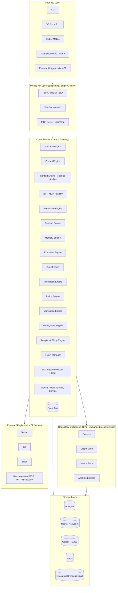
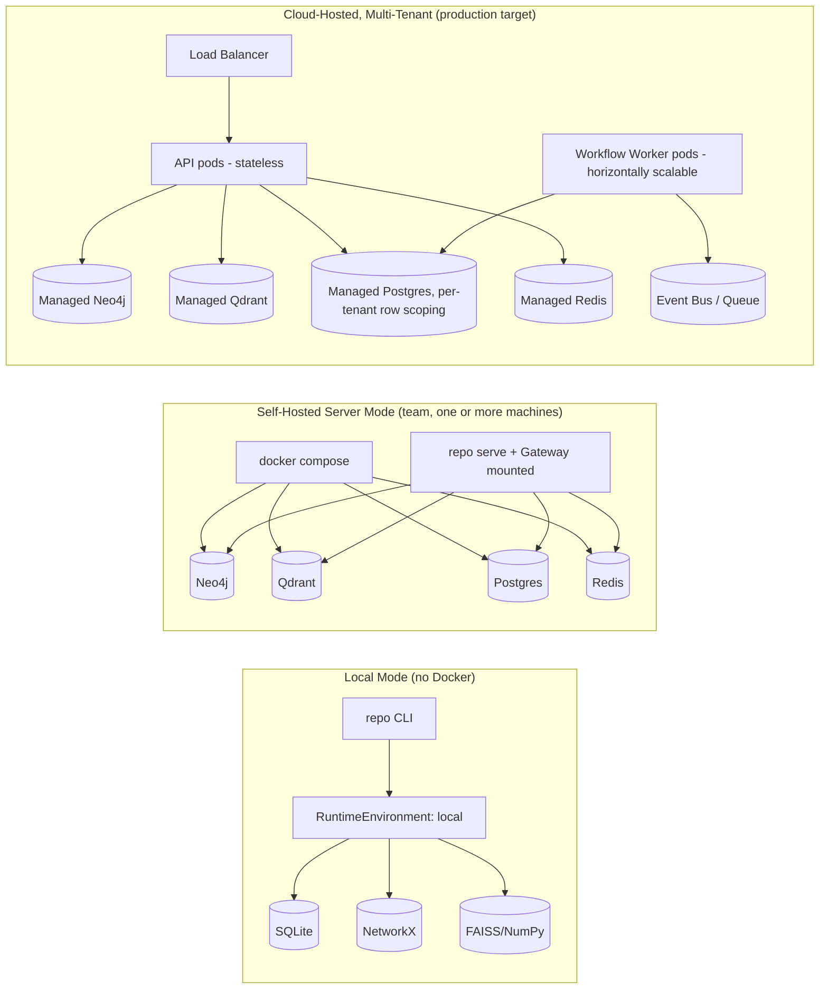
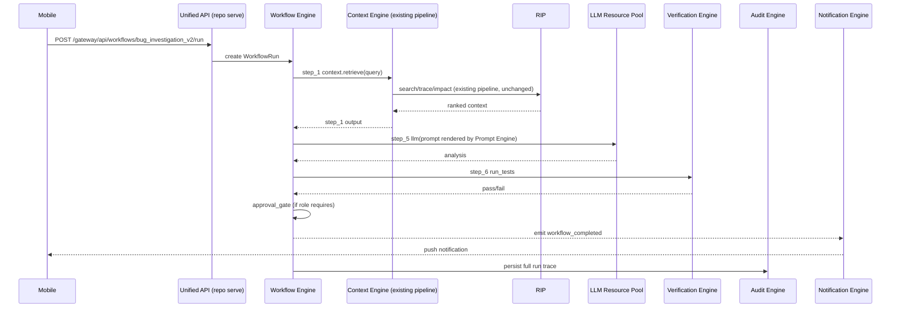

# new_system.md
## The RIP + Context Gateway Master Architecture Specification
### (Control Plane for AI Software Engineering — Block-Based, Workflow-Driven, Water-Adaptable)

> **Status of this document:** This is the single source of truth for the future architecture. It is written for an AI coding agent (or human engineer) to pick up and implement module by module, without needing to re-derive intent from chat history. It assumes full read access to `TASK.md`, the RIP codebase, and the `gateway/` codebase as they exist today.

---

## 0. How This Document Is Organized

1. Executive Vision
2. Audit of the Current System (what exists today, verified against `TASK.md`)
3. Architectural Gaps (what's missing, and why it matters)
4. Future Vision (the control-plane model)
5. Layered / Block Architecture (the core design)
6. Block Catalog (every engine, its contract)
7. Workflow Engine Design
8. Context Engine Design (the existing Gateway pipeline, preserved)
9. MCP & Tool Registry (built-in + user blocks)
10. Plugin System / Extension SDK
11. Permission, Session, Memory, Prompt Systems
12. AI Execution & Verification Systems
13. Multi-Tenancy & Identity
14. LLM Resource Pool
15. Mobile / Web / VS Code / CLI / API surfaces
16. Cloud / Self-Hosted / Local Deployment Architecture
17. Data Flow & Sequence Diagrams
18. Security Model
19. Observability & Monitoring
20. Folder Structure
21. Interface Definitions (concrete contracts)
22. Example Workflows
23. Example MCP Integrations
24. End-to-End Execution Flow
25. Development Phases (implementation roadmap)
26. Migration Plan (non-breaking, additive)
27. Long-Term Product Roadmap

---

## 1. Executive Vision

> **Deployment reality check, stated up front:** this system runs on **a single laptop/desktop**, for **one developer** (occasionally shared with a small team over LAN/Tailscale-style access, never a multi-tenant SaaS). There is no organization, no billing, no SSO, and no fleet of servers. Every design decision below is filtered through that constraint: **no block, engine, or phase in this document may require a second machine, a managed cloud service, or an enterprise identity provider to work.** Where the original vision docs described organization/team hierarchies, LLM cost governance across teams, or compliance-grade audit for auditors, this document keeps those ideas as *optional, clearly-marked-future* extension points — never as something the laptop build depends on.

RIP (Repository Intelligence Platform) turns source code into a queryable knowledge graph + semantic index. Context Gateway turns that intelligence, plus GitHub/Jira/Slack/any-MCP-server, into optimized, permissioned, auditable context for AI agents. Today the Gateway is a **context optimization pipeline** (classify → plan → retrieve → rank → compress → permission-filter → return). The next evolution turns the Gateway into a **personal control plane for AI-assisted engineering**: the place where *you* define *how* your AI agents work — what workflow they follow, what tools/MCPs they may call, what prompts they use, and what gets logged — all running locally or on your own always-on machine, no cloud account required.

**Non-negotiable principle carried into this design:** every existing capability (RIP CLI/API/MCP/VS Code/Flutter, Gateway's classifier/planner/executor/ranker/compressor/session/permission/audit pipeline, dynamic MCP sources, OAuth bridge, per-user/per-project tool allocation) keeps working exactly as-is. New capability is added as new blocks that sit *around* this pipeline, never inside a fork of it.

RIP stays the intelligence engine. It does not become the workflow engine. The Gateway consumes RIP as one (privileged, always-on) source among many.

---

## 2. Audit of the Current System (Verified Against `TASK.md`)

This section is the "as-built" record. It exists so future agents don't re-implement what's already there.

### 2.1 RIP — Repository Intelligence Platform

| Layer | Implemented |
|---|---|
| Parsing | Tree-sitter based parsers: Python, TypeScript, Java, Go, Rust, Dart/Flutter (widgets recognized). Module-level entities, `EXTENDS`, `CONTAINS`, `CALLS`, `IMPORTS`, `DEPENDS_ON`, `IMPLEMENTS`. |
| Graph | Neo4j (server mode) / NetworkX (local mode) via a `GraphStore` interface. Project-scoped (`project_id` on every node/edge). Batch `UNWIND` writes, git-ownership/churn ingestion. |
| Vector Search | Qdrant (server mode) / FAISS-or-NumPy fallback (local mode) via a `VectorStore` interface. Hybrid search (BM25 + semantic + graph expansion), reranker, embedding cache keyed by content hash. |
| Metadata | PostgreSQL (server) / SQLite under `.repo-intel/local/` (local) via a `MetadataStore` interface. Projects, file hashes, index state, API keys, embedding cache. |
| Analysis | Dead-code detector, coupling analyser, risk scorer, architecture generator, onboarding engine, dependency view. |
| LLM Layer | Multi-provider (Ollama/OpenAI/OpenRouter/Anthropic/Google/Groq/Azure) with fallback chain; graph-first context assembly for `explain`; CLI/API parity for `--diagram/--tree/--deps/--no-llm/--max-hops/--provider/--model`. |
| Interfaces | CLI (Typer, lazy-imported, verbose logging with per-command log files), FastAPI server (`repo serve`, persistent runtime, `/health` public, everything else behind `RIP_API_KEYS`/DB-backed API keys), MCP stdio server (search/trace/impact/explain/onboard/architecture/metrics), VS Code extension (chat-first, secondary sidebar, live terminal streaming), Flutter mobile app (chat-first Android client). |
| Runtime Modes | `core/runtime/` — `Capability` enum, `RuntimeEnvironment`, `resolver` (`auto`/`server`/`local`), `repo doctor`. Local mode needs no Docker; server-only capabilities (REST, WS, Flutter, Gateway, remote Git) fail gracefully with upgrade guidance in local mode. |
| Remote | Git-URL cloning + background indexing (`core/git/cloner.py`), `/git/index`, `/git/status/{job}`, `/git/jobs`, `/projects/*`, `WS /ws/index/{job_id}`, project-scoped multi-project queries, API-key auth (env-var and DB-backed with hashing/expiry/revocation). |

### 2.2 Context Gateway (`gateway/`)

| Layer | Implemented |
|---|---|
| Classifier | Rule-based intent classifier (bug_fix, feature_addition, refactor, architectural_question, investigation, documentation, dependency) + domain detection (payment, auth, api, database, notification, infrastructure) + LLM fallback below a confidence threshold (Phase 14). |
| Planner | Strategy table per intent → ordered `RetrievalPlan` with per-source queries, priorities, token-budget allocation. Extended with **domain-hint matching for dynamic sources** and low-priority participation for untagged dynamic sources. RIP `explain` is a **required, first-run priority query** in every plan, promoted to first fallback for other RIP query types. |
| Sources | `BaseSource`/MCP client interface. Built-ins: RIP (CLI-first, threaded subprocess, Windows-safe, query-type fallback chains), GitHub, Jira, Slack — all now **registry rows**, not hardcoded config, and default to `oauth2` auth. `DynamicMCPSource` supports arbitrary **streamable-HTTP, SSE, and stdio** MCP servers registered at runtime, with `initialize`/`tools/list`/`tools/call`, capability persistence, and `no_usable_tool` handling. |
| Execution | Parallel executor, exponential-backoff retry, per-source circuit breaker, per-source timeout. Emits a **backend-owned live event stream** (`intent`, `plan`, `source_start/done/skipped/failed`, `conflict_check/found`, `rank`, `dedup`, `compress`, `permission_filter`, `done`) with `session_id`, `seq`, `ts`, replayable via ring buffer. |
| Ranking/Compression | Weighted scorer (semantic, centrality placeholder, recency, pattern, authority), deduplicator, token-budget compressor, overflow summarizer. |
| Memory | Session store (Postgres-backed), conflict detector for overlapping active sessions on the same files, context bridge for follow-ups. |
| Permissions | Role model (`junior_dev/developer/senior_dev/ci_agent`), sensitive-domain policies, audit logging (now persistent in Postgres, not just log lines). |
| MCP Server | 4 tools: `get_context`, `validate_change`, `search_codebase`, `explain_architecture`. |
| HTTP Server | Mounted **inside the same RIP FastAPI process** (`repo serve`) under `/gateway/*`, sharing RIP's API-key auth — mobile/web use **one connection, one API key**. |
| External Sources | GitHub/Jira/Slack as configurable dynamic-capable builtins; graceful degradation when disabled/unreachable. |
| CLI | `gateway start/status/sources list|enable|disable/mcp config/add <source>/oauth providers|list|setup|reauthorize|revoke`. |
| Learning Loop | Feedback store, scorer-weight adjustment, LLM-fallback classifier (placeholder few-shot prompts). |
| OAuth Bridge | Provider registry, PKCE + state + TTL pending-request store, encrypted token store, refresh scheduler, `needs_reauth` transitions, reauthorize/revoke endpoints, **per-user + per-project token scoping** (`user_oauth_tokens`), mobile deep-link callback capture, CLI localhost-loopback callback capture. |
| Universal MCP | Any registered source can be `streamable_http`, `sse`, or `stdio` (Gateway executes stdio server-side only). |
| Project Scoping | `registered_sources.project_id`; sources are global/protected (RIP, and OAuth-connected builtins once authorized) or project-scoped (custom MCP tools). Runtime hydration filters by `project_id` + current API-key user. |
| Credential Vault / Integrations | `/gateway/api/integrations` mobile-first, no-CLI connect flow: OAuth or API-key entry, encrypted vault storage never returned in plaintext, `source_project_links` table for **many-to-many, replace-on-save** project allocation, audit events on connect/reconnect/disconnect/allocation change. |

### 2.3 Flutter Mobile App

Chat-first single screen (no separate search/explain/projects screens), drawer for projects/history/settings, multi-chat sessions (Drift-backed), command parser (`/search`, `/explain --deps --code --tree --diagram --no-llm --max-hops --provider --model --level`, `/trace`, `/impact`, `/architecture`, `/metrics`, `/onboard`, `/dependencies`, `/index`, `/projects`, `/dead-code`), response-block rendering (workflow tree, Mermaid, tables, file lists, impact cards), live pipeline trace UI (`PipelineStepList` → `PipelineSummaryChip`, backed only by real backend events, never simulated), Integrations screen (connect/reconnect/disconnect, project allocation checklist, OAuth browser + deep link, API-key fallback, discovered MCP tool chips), unified single server URL + single API key.

### 2.4 What This Audit Tells Us

The **Context Engine** (classifier → planner → executor → ranker → compressor → permissions → session/conflict → audit) is mature and production-shaped. The **Tool Registry** is already dynamic and user-extensible (this is further along than the original vision docs assumed — Phase 3 "Universal MCP Support" is done). What is **not yet built** is everything above the context pipeline: a genuine **Workflow Engine** (multi-step DAGs with tool-execution + approval gates, not just one-shot context retrieval), a **Prompt Engine** (versioned, reusable, variable-templated prompts decoupled from Python string literals), **multi-tenancy** (org/team, not just per-API-key user), an **LLM Resource Pool/Router** (today there is per-request provider/model override, not a policy-driven pool with cost/region/health awareness), a **Verification/Deployment Engine** (test running, PR creation, CI hooks), a **Notification Engine** (push/email/Slack outbound), a **Plugin Manager/SDK** for third parties to ship blocks, and a **Billing/Analytics Engine**.

---

## 3. Architectural Gaps

| Gap | Why it matters | Section that fills it |
|---|---|---|
| No multi-step Workflow Engine — Gateway is single-shot request/response | Can't express "trace → check commits → analyze → open PR → notify" as one reusable unit | §7 |
| No Prompt Engine — prompts are inline Python strings in `context_assembler`/`explain` | Can't version, A/B test, or let teams own prompt IP | §11.3 |
| No multi-tenancy — identity is "the RIP API key" | Can't do org policy, team LLM pools, per-team budgets | §13 |
| No LLM Resource Pool/Router — only per-call provider/model string | Can't do failover pools, cost limits, region compliance, health-based routing | §14 |
| No Verification Engine — nothing runs tests / lints generated changes | Workflows that "fix a bug" can't self-check | §12.2 |
| No Deployment Engine — nothing opens PRs / merges / deploys | Workflows can analyze but not act | §12.3 |
| No Notification Engine — mobile push / email / Slack-outbound don't exist as a block | Approval gates and completions have nowhere to notify | §6.9 |
| No Plugin Manager / SDK — dynamic MCP sources exist, but there's no packaging/versioning/marketplace concept for *workflow blocks* (not just MCP sources) | Third parties can't ship a "custom user block" cleanly | §10 |
| No Analytics/Billing Engine — usage/cost tracked ad hoc, not aggregated per org/team/user | No enterprise cost governance | §6.11 |
| No formal Event Bus — live pipeline events exist per-session, but there's no org-wide event backbone for cross-cutting concerns (billing, notifications, audit, workflow triggers) | Blocks can't subscribe to "any event of type X" | §5.4 |
| No approval-gate primitive at the engine level — only OAuth-connect approval exists | Workflows can't pause for human sign-off mid-execution | §11.4, §7.3 |
| No SSO / enterprise identity — only bearer API keys | Enterprises will require SAML/OIDC | §13.4, §18 |
| No secrets-rotation policy beyond encrypted-at-rest | Long-lived vault needs rotation/expiry hygiene | §18 |
| No workflow marketplace | Templates today are hand-authored per org; no sharing surface | §26 |

All of these are **additive**: none require touching the existing classifier/planner/executor/ranker/compressor/permission/audit code paths. They wrap around them.

---

## 4. Future Vision

> Users stop calling `get_context` directly and start **defining workflows**. A workflow is: *trigger → retrieval blocks (RIP/MCP) → prompt block → AI model block → tool/execution blocks → verification block → approval gate → deployment block → notification block → memory-write block*. Agents (Claude, Codex, GPT, Gemini, future models) become interchangeable **execution engines** invoked by the Workflow Engine's `llm` step type. The Gateway is the brain; RIP remains the eyes into the codebase; MCP servers are the hands.

Everything must be operable from **web, mobile, VS Code, and CLI** with the same underlying API — one identity, one permission model, one audit trail.

---

## 5. Layered / Block Architecture

### 5.1 Layer Diagram



### 5.2 The Block Contract

Every engine in the Control Plane is a **Block**. A Block is the unit of composition inside a Workflow and the unit of extension for third parties. Every block, built-in or user-defined, implements the same shape:

```
Block
├── id: str                     # stable identifier, e.g. "rip.trace", "prompt.bug_fix_v2"
├── kind: BlockKind              # trigger | retrieval | prompt | model | tool | approval |
│                                 verification | deployment | notification | memory | custom
├── input_schema: JSONSchema
├── output_schema: JSONSchema
├── config_schema: JSONSchema    # static configuration set at workflow-design time
├── requires_capabilities: [Capability]   # e.g. NETWORK, GRAPH_STORE, LLM, SUBPROCESS
├── run(ctx: ExecutionContext, inputs: dict, config: dict) -> BlockResult
└── describe() -> BlockManifest  # for the workflow designer UI / marketplace listing
```

This is the single abstraction that makes the system "water-like": any new capability (a new MCP server, a new verification check, a new deployment target) is just a new Block registered with the Plugin Manager. Nothing else needs to change.

### 5.3 Why This Is Additive, Not a Rewrite

The existing Gateway pipeline (`classifier → planner → executor → ranker → compressor → permission filter`) becomes exactly **one Block**: `context.retrieve` (kind=`retrieval`, wraps the entire current `get_context` call). A workflow that just wants "the current Gateway behavior" is a one-block workflow. Nothing about existing `/gateway/api/context` behavior changes; it simply also becomes invocable as a workflow step.

### 5.4 Event Bus

A lightweight, Postgres-backed (later swappable for Redis Streams/Kafka) event bus underlies cross-cutting concerns:

```
Event { id, org_id, project_id, session_id, workflow_run_id, type, source_block_id, payload, ts }
```

The existing live-pipeline event stream (`intent`, `plan`, `source_start`, ... `done`) already matches this shape — it is **absorbed as the Context Engine's event emissions**, not replaced. Audit Engine, Notification Engine, Analytics Engine, and Workflow Engine's step-transition logic are all just **subscribers** on this bus. This is the "event driven where appropriate" requirement satisfied without inventing a second protocol.

---

## 6. Block Catalog

Each block below states: Responsibility, Interfaces (in/out), Inputs, Outputs, Dependencies, Extension points, and — where relevant — mapping to code that already exists.

### 6.1 Workflow Engine
- **Responsibility:** Own workflow templates (DAG of Blocks), execute runs, manage state per run, support conditional branches and approval pauses.
- **Depends on:** Event Bus, Execution Engine, Identity Service, Storage (Postgres).
- **New code**, built as `gateway/gateway/core/workflow/`.

### 6.2 Prompt Engine
- **Responsibility:** Store versioned prompt templates with variable interpolation (`{{step_id.output_field}}`, `{{params.x}}`), attach to workflow `prompt` blocks, track outcome metrics for A/B comparison.
- **Reuses:** existing `core/llm/context_assembler.py` / RIP prompt templates as the seed template library.
- **New code**, `gateway/gateway/core/prompts/`.

### 6.3 Context Engine (preserved)
- **Responsibility:** Exactly today's pipeline. Exposed as the `context.retrieve` block and continues to be reachable directly via `/gateway/api/context` for backwards compatibility.
- **No changes required.**

### 6.4 Tool / MCP Registry (preserved + generalized)
- **Responsibility:** Already generalized (`registered_sources`, `DynamicMCPSource`, streamable-HTTP/SSE/stdio). Extend so registry rows can be tagged as **workflow tool blocks**, not only context-retrieval sources — i.e., a registered MCP tool can appear in the Workflow Designer's block palette directly.
- **Change needed:** add `usable_as: [retrieval, tool_action]` to `registered_sources` / block manifest so the same MCP registration surfaces both as a context source *and* as an executable workflow action.

### 6.5 Permission Engine (preserved)
- **Responsibility:** Role-based filtering of context (existing) **plus** workflow-level authorization ("can this role trigger this workflow", "does this action require approval"). The existing `roles.py` policy table is extended with a `workflow_policies` table keyed by `(role, workflow_id, action)`.

### 6.6 Session Engine (preserved)
- **Responsibility:** Existing session/conflict-detection store, now also the anchor for `workflow_run_id` so a workflow run and a chat session can share conflict-detection state (an agent running a workflow on a file is visible to a human chatting about the same file).

### 6.7 Memory Engine (extended)
- **Responsibility:** Existing session memory + conflict/context-bridge, **extended** into organizational memory: every completed workflow run writes a `memory_entry` (decision, evidence, outcome, approvers) indexed by the existing Qdrant/vector layer so future workflow runs retrieve "similar past work" as an additional Context Engine source (`memory.search`, a new built-in retrieval block, not a change to RIP).

### 6.8 Execution Engine
- **Responsibility:** Runs a single Block given resolved inputs; handles retries/timeouts/circuit-breaking (reuses the existing executor's retry/backoff/circuit-breaker code, generalized to run arbitrary Block types, not only MCP source queries).

### 6.9 Notification Engine
- **Responsibility:** Deliver events to mobile push, email, Slack-outbound, in-app. Subscribes to the Event Bus for `approval_required`, `workflow_completed`, `conflict_found`, `source_needs_reauth`.
- **New code**, thin — mobile push via existing app's device-token registration (new), email via SMTP/provider adapter, Slack-outbound reuses the existing Slack MCP client in write mode.

### 6.10 Policy Engine
- **Responsibility (laptop scope):** simple standing rules for *your own* repositories — e.g. "the `payment/` folder always requires an approval gate before a deployment block runs" — not organization/team governance. Sits above the Permission Engine.

### 6.11 Usage Tracker (was "Analytics / Billing Engine")
- **Responsibility (laptop scope):** a small local dashboard of your own token usage and cost per LLM call, so you know what a workflow run cost you. No org/team rollups, no billing integration — it's just `GET /gateway/api/metrics` showing numbers for the one user that exists. The full org/team billing rollup design from the original vision docs is kept as an appendix idea only (§27), not something to build.

### 6.12 Plugin Manager
- **Responsibility:** Discover, validate, version, and sandbox third-party Blocks (MCP-backed or pure-logic). Builds on the existing dynamic-source registration flow (`POST /gateway/api/sources`) by adding a manifest format (`block.json`) so a registration can declare itself as more than a context source.

### 6.13 LLM Resource Pool / Router
- **Responsibility (laptop scope):** Registry of your configured LLMs (provider, model, health), simple name-based routing (§14). No team policy, no cost/region governance.

### 6.14 Identity Service (Single-User; No Multi-Tenancy Today)
- **Responsibility:** Wraps the existing per-API-key user model as-is — one API key is "you." No Organization/Team hierarchy exists in the laptop build (§13). This block is a thin pass-through today so nothing needs to change in the (unlikely) future where a second user shows up.

### 6.15 Verification Engine
- **Responsibility:** Run tests/linters/type-checks against a workflow-generated change; report pass/fail + logs as block output consumable by an approval gate or deployment block. Executes via a sandboxed `terminal`/`subprocess` tool block (new, MCP-shaped: a local "terminal MCP server" the Gateway already lists as a category in the vision — implemented as a first built-in MCP tool).

### 6.16 Deployment Engine
- **Responsibility:** Open branches/PRs, request reviewers, merge, trigger CI/CD, roll back. Implemented as workflow **tool blocks** calling the GitHub/GitLab/CI MCP sources in write mode (today's GitHub source is read-mostly; this extends its scope with explicit write-permission gating from the Policy Engine).

### 6.17 Audit Engine (preserved + extended)
- **Responsibility:** Existing persistent Postgres audit log for context/source/OAuth events, **extended** to also record every workflow step transition, approval decision, and deployment action, with the existing immutable-hash-chain concept (§18) layered on top.

---

## 7. Workflow Engine Design

### 7.1 Template Schema (concrete, implementable)

```yaml
id: bug_investigation_v2
version: 2.1.0
category: investigation
visibility: organization | team | private
params:
  - {name: target_repository, type: string, required: true}
  - {name: bug_description, type: text, required: true}
  - {name: priority, type: enum, values: [low, medium, high, critical], default: medium}

llm_config:
  selection_strategy: policy_based | fixed | cheapest | fastest
  fallback_chain: [llm_id_1, llm_id_2]
  per_step_overrides: [{step_id: analyze_impact, llm: claude-primary}]

plan:
  steps:
    - {id: step_1, type: tool,  block: rip.search,            inputs: {query: "{{params.bug_description}}", project_id: "{{params.target_repository}}"}}
    - {id: step_2, type: tool,  block: rip.trace,              inputs: {symbol: "{{step_1.top_result}}"}}
    - {id: step_3, type: tool,  block: github.recent_commits,  inputs: {files: "{{step_1.files}}", days: 30}}
    - {id: step_4, type: prompt, prompt_id: root_cause_v1,      inputs: {code: "{{step_1}}", deps: "{{step_2}}", commits: "{{step_3}}"}}
    - {id: step_5, type: llm,    model_policy: "investigation", inputs: {prompt: "{{step_4.rendered}}"}}
    - {id: step_6, type: verification, block: terminal.run_tests, inputs: {scope: "{{step_2.affected_files}}"}}
    - {id: step_7, type: tool,  block: notification.send,       inputs: {to: "{{trigger.user}}", message: "Investigation complete"}}

  approval_gates:
    - after: step_5
      condition: "{{trigger.user.role}} == 'junior_dev'"
      require_role: senior_dev

  memory_persistence:
    save: {finding: "{{step_5.output}}"}
    tags: ["bug", "{{params.target_repository}}"]

notifications:
  on_completion: [{user: "{{trigger.user}}"}]
```

### 7.2 Execution Semantics

- DAG resolved topologically; independent steps run in parallel (reuses the Execution Engine's existing parallel-source machinery).
- Every `tool`/`retrieval` step is a Block call; every `llm` step routes through the LLM Resource Pool; every `prompt` step is rendered by the Prompt Engine before the following `llm` step runs.
- State persists after every step (`WorkflowRun.state` in Postgres) so runs are resumable after a crash — mirrors RIP's existing "resume at the first unchecked task" ledger discipline, now made a first-class system property instead of a markdown convention.

### 7.3 Approval Gates

An approval gate is a `Block` of kind `approval` whose `run()` **suspends** the workflow (writes `status=awaiting_approval`, emits `approval_required` on the Event Bus, returns control) until a `POST /workflows/runs/{id}/approve|reject` call resumes it. This is the concrete mechanism behind vision-doc mobile approval screens.

### 7.4 Mobile Block-by-Block Workflow Builder (No-Code, This Is the Point of Blocks)

This is the concrete mobile feature this whole block architecture exists to serve: **a user builds a workflow on their phone by adding blocks one at a time, saves it, and later runs it by typing a query** — no YAML, no desktop.

#### 7.4.1 Build-Time UX (Add Block → Add Block → Save)

```
Drawer → Workflows → "New Workflow"
  1. Name it ("Investigate payment bug")
  2. Tap "+ Add Block" → Block Palette bottom sheet, grouped by kind:
       RIP            → search / trace / impact / architecture / explain / metrics
       Tools (MCP)    → any registered source tagged usable_as: tool_action
                        (GitHub, Jira, Slack, or a user's own custom MCP server)
       Prompt + AI    → "Ask AI" block (pick a saved Prompt Template, or write one inline)
       Verification   → run tests / lint
       Deployment     → open PR / notify reviewers
       Notification   → push / Slack message
       Approval       → "pause for approval from <role>"
       Custom         → any block the user or org has registered (Plugin Manager, §10)
  3. Tapping a block opens a small config sheet:
       - static config fields (from the block's config_schema)
       - input bindings: for each required input, either
           (a) "From query"  → bound at run-time from the free-text trigger query, or
           (b) "From step N" → bound from an earlier block's output field, or
           (c) a fixed literal value typed now
  4. Block appears as a numbered card in the workflow list (drag to reorder, swipe to delete)
  5. Repeat "+ Add Block" for as many steps as wanted
  6. Tap "Save" → workflow is persisted as a WorkflowDraft, scoped to the active project
     (or organization, if the user has that role) and immediately runnable
```

This mirrors, on mobile, exactly the same interaction the desktop Web Workflow Designer canvas (§27) offers — the API underneath is identical, only the presentation differs (vertical block list vs. drag/drop canvas). Mobile is not a lesser client; it is a first-class builder.

#### 7.4.2 Data Model

```yaml
WorkflowDraft:
  id: uuid
  owner_user_id: uuid
  scope: project | organization
  project_id: uuid | null
  name: string
  status: draft | published
  blocks:                       # ordered list — this array IS the DAG for the common linear case
    - step_id: step_1
      block_id: "rip.search"          # references the Block Registry / MCP registry entry
      config: {limit: 10}
      input_bindings:
        query: {source: "trigger_query"}          # bound from the free-text query at run time
    - step_id: step_2
      block_id: "rip.trace"
      config: {depth: 6}
      input_bindings:
        symbol: {source: "step_output", step_id: "step_1", field: "top_result"}
    - step_id: step_3
      block_id: "prompt.ask_ai"
      config: {prompt_template_id: "root_cause_v1"}
      input_bindings:
        context: {source: "step_output", step_id: "step_2", field: "*"}
        question: {source: "trigger_query"}
  created_at, updated_at
```

Branching/parallel steps are expressed the same way as §7.1's YAML (a step can list multiple `input_bindings` sources and a step can be marked `parallel_with: [step_id]`); the mobile UI simply defaults to linear and exposes "run in parallel with step N" as an advanced toggle per block, so the common case stays a flat, thumb-scrollable list.

#### 7.4.3 Trigger-by-Query (Run Time)

The whole reason a saved workflow can be triggered "with a query" instead of a structured form is that **any input bound to `source: trigger_query` is resolved by the existing Intent Classifier / LLM fallback**, not typed field-by-field by the user:

```
Mobile: open saved workflow "Investigate payment bug" → chat-style input appears:
  > "transfers over $10k are failing with a regulatory limit error"
  [Run]

Gateway:
  1. POST /gateway/api/workflows/{id}/run { query: "<free text>" }
  2. Workflow Engine loads the WorkflowDraft's blocks + declared trigger_query bindings
  3. Existing Classifier/param-extraction path (already used for `explain` intent detection,
     Phase 14 LLM fallback) extracts one value per distinct trigger_query binding needed
     by the DAG — this is a small, bounded extraction task, not a full new NLU system
  4. Execution proceeds exactly as any other WorkflowRun (§7.2): each block runs in order,
     resolving step_output bindings from prior results, emitting the same live block-by-block
     event stream (source_start/done/failed) the app already renders via PipelineStepList
  5. Final block's output (or, if the last block has no natural "answer" shape, an
     auto-generated summary block appended implicitly) is shown as the chat response,
     with the trace collapsible into PipelineSummaryChip exactly like today's Gateway answers
```

If the query is missing information a bound block strictly requires (e.g., no repository could be inferred), the run pauses at that step with `status: awaiting_input` and the app prompts inline for just that one missing field — never a blocking full-form re-entry.

#### 7.4.4 API Surface (Additive)

```
POST   /gateway/api/workflows                       # create empty draft {name, scope, project_id}
POST   /gateway/api/workflows/{id}/blocks            # append one block {block_id, config, input_bindings}
PATCH  /gateway/api/workflows/{id}/blocks/{step_id}  # edit one block in place
POST   /gateway/api/workflows/{id}/blocks/reorder    # {order: [step_id, ...]}
DELETE /gateway/api/workflows/{id}/blocks/{step_id}
POST   /gateway/api/workflows/{id}/publish           # draft -> published, now runnable
GET    /gateway/api/workflows                        # list saved workflows for user/project
POST   /gateway/api/workflows/{id}/run               # {query: string} -> starts a WorkflowRun, streams via existing WS/SSE trace channel
GET    /gateway/api/workflows/{id}/runs/{run_id}     # poll/replay a run
POST   /gateway/api/workflows/{id}/runs/{run_id}/answer_missing_input  # {step_id, value} resumes a paused run
```

Every one of these mounts under the same unified RIP host/API-key the mobile app already uses for chat and Integrations — no second connection, no second login, consistent with the one-connection principle already enforced for Gateway/Integrations.

#### 7.4.5 Why the Block Palette Is Never Empty

Because the Tool Registry (§9) already treats every user-registered MCP source as a first-class entry, the block palette a user sees on day one already includes: RIP's own blocks (built-in, always present), any GitHub/Jira/Slack they've connected (§2.2 OAuth/vault work), and any custom MCP server they've added from the Integrations screen — with zero additional registration step. Adding a *new* palette entry is exactly the existing "Add Integration" flow (§2.2, §10) plus one new field, `usable_as: ["tool_action"]`, so a source shows up as a droppable block, not only as an implicit context source.

---

## 8. Context Engine Design (Unchanged, Wrapped)

The Context Engine **is** today's Gateway pipeline. It is invoked two ways:

1. **Directly** (today's behavior, preserved): `POST /gateway/api/context`.
2. **As a Block** inside a workflow (`type: retrieval, block: context.retrieve`), with the same request/response shape, so no logic is duplicated.

No changes to `core/planner`, `core/executor`, `core/ranker`, `core/compressor`, `core/permissions` are required for this document's scope. The only structural addition is exposing them through the generic `Block.run()` signature via a thin adapter (`gateway/gateway/core/blocks/context_retrieve.py`).

---

## 9. MCP & Tool Registry

### 9.1 Two Categories (already implemented, formalized here)

- **Built-in MCPs**: RIP (privileged, always-on, non-deletable, non-disableable), GitHub, Jira, Slack. Extendable list: GitLab, Filesystem, Terminal, Docker, Browser, Database, CI/CD — each added as a new `SourceKind=builtin` row + adapter class, following the exact pattern already used for GitHub/Jira/Slack.
- **User MCPs**: any `streamable_http` / `sse` / `stdio` MCP server registered via `POST /gateway/api/sources`, scoped to a project or (new) an organization. Already supports capability discovery (`tools/list`), credential vaulting, per-user OAuth, and project allocation.

### 9.2 What's New Here

Add a `usable_as` field so a registered source can be surfaced in the **Workflow Designer's block palette** as a `tool` step, not only consulted implicitly by the planner during `context.retrieve`. This is a pure additive schema field; no behavior for existing rows changes (defaults to `["retrieval"]`).

---

## 10. Plugin System / Extension SDK

### 10.1 Block Manifest (`block.json`)

```json
{
  "id": "org.acme.deploy_lambda",
  "kind": "deployment",
  "version": "1.0.0",
  "transport": "streamable_http",
  "endpoint": "https://acme.internal/mcp",
  "auth_type": "api_key",
  "input_schema": {"type": "object", "properties": {"function_name": {"type": "string"}}},
  "output_schema": {"type": "object", "properties": {"deployment_url": {"type": "string"}}},
  "requires_role": "senior_dev"
}
```

### 10.2 Lifecycle

Register → Test (reuses existing `/oauth`-or-`/credential` + `/test` endpoints) → Discover capabilities (`tools/list`) → Publish to org's block palette → (optional) submit to the **Workflow Marketplace** (§26) for cross-org sharing, gated by an organization's `visibility: organization|team|private` setting already present in the workflow template schema.

Sandboxing: `stdio` blocks execute **server-side only** (never on mobile/web clients), matching the existing universal-MCP implementation's explicit constraint.

---

## 11. Permission, Session, Memory, Prompt Systems

### 11.1 Permission (preserved model, extended scope)
Existing roles (`junior_dev/developer/senior_dev/ci_agent`) gain a `workflow_policies` table: `(role, workflow_id|category, action, allowed: bool, requires_approval_from: role|null)`.

### 11.2 Session (preserved)
`ChatSession`/`WorkflowRun` share a `session_id` namespace so conflict detection spans both chat and workflow execution against the same files.

### 11.3 Prompt Engine (new)
```
PromptTemplate { id, version, system_prompt, prompt_template, variables[], owner_org, visibility }
render(template, context: dict) -> str   # Jinja2-style {{var}} substitution, reusing patterns already in RIP's explain templates
```
Prompt outcomes (linked workflow run → user feedback existing in Gateway's `POST /feedback`) feed the Learning Loop already built in Phase 14 — no new feedback pipe needed, just a new `prompt_id` foreign key on the existing feedback row.

### 11.4 Memory (extended)
`memory_entry(id, org_id, project_id, workflow_run_id, type, summary, embedding, tags[], ttl)`. Retrieval is a new built-in Context Engine source (`memory.search`), planned by the existing planner using the same domain-hint mechanism already built for dynamic sources.

---

## 12. AI Execution & Verification Systems

### 12.1 AI Execution (LLM step)
An `llm` step resolves `model_policy` → LLM Resource Pool → provider adapter (RIP's existing `core/llm/client.py` fallback chain, reused verbatim as the low-level call). Streamed tokens (if `stream: true`) republish onto the Event Bus as `llm_token` events so mobile/web can show live generation — extending, not replacing, the existing live-trace UI.

### 12.2 Verification Engine
A `terminal` built-in MCP block (new) exposes `run_command(cmd, cwd, timeout)` under strict allow-listing (Policy Engine: which commands/paths are permitted per repository protection level). Verification steps call this block to run tests/linters and attach pass/fail + logs to the run state.

### 12.3 Deployment Engine
Composed from existing GitHub source (extended to a write-capable mode: create branch, commit, open PR) gated by `requires_role` in the Permission Engine and, for `protection: critical` repositories, a mandatory approval gate before the deployment block executes.

---

## 13. Identity & Multi-Tenancy

Identity is a first-class part of this build, not an optional add-on. Every request — CLI, mobile, web, VS Code, or an external agent calling in via MCP — resolves to a `user`, and every `user` belongs to an `organization` and (optionally) one or more `team`s. A single-person install is simply an organization with one team and one user; nothing is skipped or stubbed to get there — it is the same schema and the same code path as a ten-person team.

### 13.1 Data Model (built in full)

```yaml
organization:
  id, name
  settings: {default_llm_pool: [llm_id], cost_limits: {monthly, per_user}, audit_retention_days}

team:
  id, organization_id, name
  policies: {allowed_llms, blocked_llms, approval_rules, repo_permissions, cost_limits}
  members: [user_id]

user:
  id, organization_id, team_ids[], role, preferences: {default_llm, per_workflow_llm}, api_key_id
```

`role` is one of `admin | team_lead | senior_dev | developer | junior_dev | ci_agent`, matching the roles the Permission Engine already enforces today (§6.5, §11.1) — this design extends that enforcement to workflows and teams rather than introducing a second role system.

### 13.2 Bootstrapping (Zero Friction for a Single User)

The very first RIP API key ever created on an install automatically provisions `organization("default")`, `team("default")`, and `user(role=admin)`. A single developer never sees an "invite your team" screen unless they choose to add a second user — but the underlying multi-tenant model is live from the first request, so growing from one user to fifty requires zero migration, zero re-architecture, and zero downtime.

### 13.3 Scope Resolution

Preference/policy resolution follows `org → team → user`, most-specific-wins, using exactly the same `user_id (+ project_id + source)` scoping pattern already implemented for per-user OAuth (§2.2) — extended, not replaced, to also resolve LLM policy, workflow visibility, and approval requirements.

### 13.4 Enterprise Identity (SSO/SAML/OIDC)

SSO sits in front of the Identity Service as an additional login method that still issues the same downstream RIP API key/session token — every other layer of the system is unaware of how a user authenticated. This is built as part of the full system, not deferred: `IdentityProvider` is an interface (`authenticate(credential) -> user`) with `ApiKeyProvider` and `OIDCProvider` as two concrete implementations from day one.

---

## 14. LLM Resource Pool

The LLM Resource Pool is a governed registry and router, not a convenience lookup. It manages every configured provider/model — local (Ollama) and cloud (OpenAI, Anthropic, Google, OpenRouter, Groq, Azure) — with health tracking, cost accounting, region awareness, and per-team/per-org policy enforcement, sitting on top of (not replacing) RIP's existing multi-provider `core/llm/client.py` fallback chain.

```yaml
llm_config:
  id, provider, model, display_name, api_endpoint, api_key_vault_path, region
  capabilities: {max_context_tokens, max_output_tokens, supports_streaming, supports_function_calling}
  cost: {input_per_1k_tokens, output_per_1k_tokens}
  rate_limits: {requests_per_minute, tokens_per_minute}
  status: active | degraded | disabled
  health_metrics: {avg_latency_ms, error_rate_pct, last_checked}
```

Routing function: `resolve(user, team, workflow_step, context_size) -> llm_config`, applying allowed-set intersection (team ⊆ org), user preference if within the allowed set, budget check, region-compliance check, and health check, in that order — the full algorithm from §4/§14's origin design, fully implemented, not a "one-user shortcut."

---

## 15. Interface Surfaces

| Surface | Existing | New in this design |
|---|---|---|
| CLI | `repo *`, `gateway *` | `gateway workflow run/list/create`, `gateway prompt list/create`, `gateway org/team` admin commands |
| VS Code | Chat-first sidebar | Workflow trigger from context menu, approval inline |
| Flutter Mobile | Chat, Integrations, live trace | **Block-by-block Workflow Builder (§7.4): add/reorder/save blocks, then trigger the saved workflow with a free-text query**, approval push notifications, org/team switcher |
| Web Dashboard | none | New: full parity with mobile + workflow designer canvas (drag/drop blocks), organization admin console |
| REST API | `/gateway/api/*`, `/api/*` (RIP) | `/gateway/api/workflows/*`, `/gateway/api/prompts/*`, `/gateway/api/orgs/*`, `/gateway/api/llms/*` |
| MCP Server | 4 RIP-Gateway tools | Workflows themselves become optionally MCP-exposed (`run_workflow` tool) so external agents (Claude Code, Codex, Cursor) can trigger organizational workflows, not just raw context |

All surfaces authenticate through the same Identity Service; mobile/web/VS Code/CLI are peers, not a hierarchy.

---

## 16. Deployment Architecture

The system is designed to run identically at three scales — a single laptop, a self-hosted team server, or a managed multi-tenant cloud — with **no change to business logic**, only to which storage providers are bound at startup (the existing `RuntimeEnvironment`/`resolver` pattern already implemented in RIP). All three are real, supported deployment targets of this specification, not a hypothetical extension.



Local/self-hosted/cloud differ only in which `GraphStore`/`VectorStore`/`MetadataStore` provider is bound — the Control Plane engines (Workflow/Prompt/Permission/Identity/etc.) are storage-provider agnostic by construction. Scaling from one user to an enterprise fleet means adding Workflow Worker pods and switching to managed data stores; it does not mean rewriting any engine.

---

## 17. Data Flow / Sequence Diagram (End-to-End Workflow Run)



---

## 18. Security Model

This is built to production/compliance-grade standards from the outset, since organizations of any size may adopt it.

- **Secrets:** all provider credentials, OAuth tokens, and MCP source secrets stay in the existing encrypted vault (`SourceCredential`/`oauth_tokens`/`user_oauth_tokens`); plaintext never leaves the Gateway process boundary — this rule already holds today and must not regress.
- **Rotation:** a scheduled job (reusing the existing OAuth refresh-scheduler pattern) flags vault entries older than a policy-defined age for rotation, surfaced in Settings for every organization, not only shared installs.
- **Transport:** all client traffic over TLS; stdio MCP execution never crosses the client boundary (already enforced).
- **AuthN:** bearer API key today, SSO/OIDC available per §13.4.
- **AuthZ:** Permission Engine (per-request) + Policy Engine (standing rules) + Workflow approval gates (per-run, human-in-the-loop) — fully enforced for every role, including single-admin installs where the admin role simply has full standing permission.
- **Audit:** every context call, source access, OAuth event, and every workflow step/approval/deployment action is persisted (Postgres, append-only). The log is hash-chained (`entry.hash = sha256(entry + previous.hash)`) by default, making it tamper-evident and export-ready for compliance customers without any later migration.

---

## 19. Observability & Monitoring

- **Structured logging:** already present per-command (`.repo-intel/logs/*.log`) and per-Gateway-module; extend with a common correlation id (`workflow_run_id`/`session_id`) threaded through every log line.
- **Metrics:** Analytics Engine exposes `/gateway/api/metrics` (already partially implemented — real aggregation replacing the stub) — active sessions, token totals, per-source health, active conflicts, now also per-workflow success/failure rate and per-LLM cost.
- **Tracing:** the Event Bus doubles as a lightweight trace store; every block emits `start`/`done`/`failed` with `seq`, giving waterfall traces for free (this is exactly today's live-pipeline-trace mechanism, generalized from "context sources" to "any block").
- **Health:** existing `/health` (public) + capability reporting extended with Workflow Engine and LLM pool health.

---

## 20. Folder Structure (Target State)

```
RIP/                                  # unchanged root
├── core/                             # unchanged: parser, graph, search, analysis, llm, runtime, storage
├── server/                           # unchanged RIP FastAPI app; mounts gateway app
├── cli/                              # unchanged repo CLI
├── gateway/
│   └── gateway/
│       ├── core/
│       │   ├── classifier/           # unchanged
│       │   ├── planner/              # unchanged (+ dynamic-source hints, unchanged)
│       │   ├── executor/             # unchanged (generalized to run any Block)
│       │   ├── ranker/               # unchanged
│       │   ├── compressor/           # unchanged
│       │   ├── permissions/          # unchanged (+ workflow_policies table)
│       │   ├── sources/              # unchanged (builtin + dynamic_mcp + mcp_transport)
│       │   ├── oauth.py              # unchanged
│       │   ├── workflow/             # NEW: engine.py, dag.py, run_state.py, approval.py
│       │   ├── prompts/              # NEW: engine.py, templates/, render.py
│       │   ├── blocks/               # NEW: base.py (Block contract), registry.py, context_retrieve.py,
│       │   │                         #      terminal.py, deployment_github.py, notification.py, memory_search.py
│       │   ├── llm_pool/             # NEW: registry.py, router.py, health.py
│       │   ├── identity/             # NEW: org.py, team.py, user.py, scope_resolver.py
│       │   ├── policy/               # NEW: engine.py, repo_policies.py, llm_policies.py
│       │   ├── analytics/            # NEW: aggregator.py, billing.py
│       │   ├── plugins/              # NEW: manifest.py, loader.py, marketplace_client.py
│       │   └── events/               # NEW: bus.py, subscribers.py
│       ├── storage/                  # unchanged models + migrations, extended with new tables
│       ├── server/
│       │   └── routers/              # unchanged routers + NEW: workflows.py, prompts.py, orgs.py, llms.py
│       └── cli/                      # unchanged + NEW workflow/prompt/org subcommands
├── vscode-extension/                 # unchanged, + workflow trigger command
├── rip_app/ (Flutter)                # unchanged, + workflow dashboard screen, org/team switcher
└── web/ (dashboard, future)          # NEW: workflow designer canvas, org admin, marketplace browser
```

---

## 21. Interface Definitions

```python
# gateway/gateway/core/blocks/base.py
from enum import Enum
from typing import Any, Protocol

class BlockKind(str, Enum):
    TRIGGER = "trigger"; RETRIEVAL = "retrieval"; PROMPT = "prompt"; MODEL = "llm"
    TOOL = "tool"; APPROVAL = "approval"; VERIFICATION = "verification"
    DEPLOYMENT = "deployment"; NOTIFICATION = "notification"; MEMORY = "memory"; CUSTOM = "custom"

class BlockResult(Protocol):
    ok: bool
    output: dict[str, Any]
    error: str | None
    events: list[dict]        # events to publish on the Event Bus

class Block(Protocol):
    id: str
    kind: BlockKind
    input_schema: dict
    output_schema: dict
    requires_capabilities: list[str]

    async def run(self, ctx: "ExecutionContext", inputs: dict, config: dict) -> BlockResult: ...
    def describe(self) -> dict: ...


# gateway/gateway/core/workflow/engine.py
class WorkflowEngine:
    def __init__(self, block_registry, event_bus, storage): ...
    async def start_run(self, template_id: str, params: dict, trigger_user) -> "WorkflowRun": ...
    async def resume_run(self, run_id: str, approval_decision: bool, by_user) -> "WorkflowRun": ...
    async def get_run_state(self, run_id: str) -> "WorkflowRun": ...


# gateway/gateway/core/llm_pool/router.py
def route_llm(user, team, workflow_step, context_size: int) -> "LLMConfig": ...
```

```typescript
// Mobile / Web shared TS contract for the workflow API
interface WorkflowRun {
  id: string; templateId: string; status: "running"|"awaiting_approval"|"completed"|"failed";
  steps: { id: string; status: string; output?: unknown }[];
  createdAt: string; completedAt?: string;
}
```

---

## 22. Example Workflows

1. **Bug Investigation** (§7.1) — search → trace → recent commits → LLM root-cause → tests → notify.
2. **Feature-from-Pattern** — `rip.search` similar implementations → `prompt.feature_impl_v1` → `llm` generate → `terminal.run_tests` → `github.open_pr` (approval gate for non-senior) → `notification.send`.
3. **Security Audit** — `rip.dead_code` + `rip.metrics` + custom MCP `org.acme.sast_scanner` (user-registered block) → LLM synthesis → mandatory `security_lead` approval → report saved to Memory Engine.
4. **Onboarding Trail** — `rip.architecture` + `rip.onboard` + `memory.search` (past onboarding notes) → LLM personalizes → notification to new hire.

---

## 23. Example MCP Integrations

- **Built-in, read+write GitHub**: existing read client extended with `create_branch`, `commit_files`, `open_pr` tool calls, gated by Policy Engine repository protection level.
- **User-registered streamable-HTTP**: internal deployment API registered exactly as today's "Custom MCP Server" flow (`endpoint`, `auth_type`, `credential`), immediately usable as a `deployment` block once tagged `usable_as: ["tool_action"]`.
- **stdio, server-only**: a local static-analysis tool launched by Gateway as a subprocess (`stdio_command`, `stdio_args`), never exposed to mobile directly — matches the existing universal-MCP stdio safety constraint.

---

## 24. End-to-End Execution Flow (Summary)

`Trigger (mobile/CLI/VS Code/agent) → Identity resolves org/team/user → Workflow Engine loads template → for each step: resolve Block → Permission/Policy check → Execution Engine runs Block (retrieval via unchanged Context Engine, or prompt/llm via Prompt Engine + LLM Pool, or tool/verification/deployment via MCP Tool Registry) → Event Bus emits step event → Audit Engine persists → Session Engine checks conflicts → optional Approval Gate suspends/resumes → on completion: Memory Engine writes entry, Notification Engine delivers, Analytics Engine aggregates cost/usage.`

---

## 25. Development Phases

### Phase A — Event Bus & Block Contract (foundation, no user-visible change)
- Implement `events/bus.py` backed by existing Postgres audit infra.
- Implement `blocks/base.py` and wrap the existing `get_context` pipeline as `context.retrieve`.
- Wrap existing dynamic MCP sources as `tool` blocks (`usable_as` field, default unchanged).

### Phase B — Workflow Engine (MVP) + Mobile Builder v1
- `WorkflowDraft`/`WorkflowRun` storage models + Alembic migration.
- Sequential (no branching yet) execution of `retrieval`/`prompt`/`llm` steps only.
- Implement the §7.4.4 API surface (`POST/PATCH/DELETE .../blocks`, `/publish`, `/run`).
- Mobile: ship the block-by-block builder UI (§7.4.1) — add block, configure bindings,
  reorder, save — plus the trigger-by-query run screen (§7.4.3), reusing the existing
  `PipelineStepList`/`PipelineSummaryChip` trace widgets unmodified.
- CLI: `gateway workflow run <template> --params ...` (parity path for non-mobile users).
- Ship 2 built-in templates as starter examples users can clone/edit from mobile:
  Bug Investigation, Architecture Overview.

### Phase C — Prompt Engine + LLM Resource Pool
- Externalize existing inline prompts into `PromptTemplate` rows.
- `LLMConfig` registry seeded from existing multi-provider config; router wraps existing `core/llm/client.py`.

### Phase D — Approval Gates + Verification + Deployment Blocks
- `approval` block type + `/workflows/runs/{id}/approve`.
- `terminal.run_tests` built-in block (sandboxed, policy-gated).
- GitHub write-mode blocks (branch/commit/PR) gated by Policy Engine.

### Phase E — Notifications + Local Usage Tracking (was "Multi-Tenancy")
- Mobile push registration (local only — your phone talking to your own laptop); Notification Engine subscribing to Event Bus.
- Real `/gateway/api/metrics` showing your own token usage/cost per workflow run (§6.11). No org/team tables — skip building multi-tenancy entirely unless a second person actually needs access to your machine.

### Phase F — Plugin Manager (Personal)
- `block.json` manifest format; publish/install flow reusing existing source-registration + test-connection UX, scoped to your own machine's block palette. No cross-org marketplace — that idea stays parked in §27 until/unless it's ever relevant.

### Phase G (optional, only if you ever share the machine) — Multi-User
- `organization`/`team` tables from §13.2; auto-migrate the existing API key into a personal org; per-user LLM preference and approval policies. **Do not build this until there is an actual second user** — it is pure speculative work otherwise.

### Phase H — Mobile/Web Workflow Surfaces
- Mobile: workflow dashboard, trigger screen, approval push (screens sketched in §15).
- Web: drag/drop workflow designer canvas consuming the same `/gateway/api/workflows/*` API.

Each phase ends with the same discipline already used across `TASK.md`: a written checkpoint, explicit verification commands, and no regression to any previously shipped surface.

---

## 26. Migration Plan (Non-Breaking, Additive)

| Existing thing | What happens to it |
|---|---|
| `POST /gateway/api/context` | Unchanged; also becomes invocable as `context.retrieve` block |
| Existing RIP CLI commands | Unchanged |
| Existing MCP tools (`get_context`, `validate_change`, `search_codebase`, `explain_architecture`) | Unchanged; new optional `run_workflow` tool added alongside |
| Existing API keys | Each becomes a `user` inside an auto-created personal `organization`; behavior identical until an admin opts into team structure |
| Existing dynamic MCP sources | Unchanged; gain optional `usable_as` field defaulting to current behavior |
| Existing OAuth/vault/project-allocation flows | Unchanged; consumed as-is by new Deployment/Tool blocks |
| Existing Flutter chat, live trace, Integrations screens | Unchanged; new Workflow Dashboard is an additional drawer entry, not a replacement |

---

## 27. Long-Term Roadmap (Personal-Scale Priorities First; Enterprise Ideas Parked)

**Build in this order, because it's what actually helps one developer on one laptop:**

1. Ship Workflow Engine MVP + mobile block-by-block builder (§7.4) + 2-3 starter templates.
2. Ship Prompt Engine + the simplified LLM Resource Pool (§14) so workflow steps can name a model instead of hardcoding one.
3. Ship Approval Gates + Verification/Deployment blocks — the first real "investigate → fix → test → PR → notify" loop, running entirely on your machine against your own repos.
4. Ship Organizational→**Personal** Memory as a retrieval source (§11.4) — the system gets smarter with *your* use, no org concept needed.
5. Ship Notifications (mobile push from your own server) + the simple local Usage Tracker (§6.11).
6. Ship the Plugin Manager (personal scope, §6.12) so you can register your own MCP tools as workflow blocks without code changes.
7. Ship a Web Workflow Designer canvas if/when a browser UI is more convenient than mobile — same API, no new backend concepts.

**Parked — do not build until there's an actual second person needing access to this system (may be never):**

- Multi-tenancy (organizations/teams), team-scoped LLM budgets, region compliance.
- Cross-org workflow marketplace.
- Enterprise SSO/SAML/OIDC.
- Hash-chained audit export for external auditors, compliance-grade governance.
- Managed-cloud deployment topology (§16's "Cloud-Hosted" box).

RIP and Gateway remain architecturally separate regardless of scale: RIP understands your code, the Gateway governs how your AI agents act on that understanding — on your laptop, for you.

---

---

## 28. Full Implementation Task Ledger (TASK.md-Style)

This is the literal build ledger for this plan, in the same checkbox convention used throughout the project's `TASK.md`. Find the first unchecked box, do that task, check it, move on. Every phase ends with a written checkpoint before the next phase starts. Nothing here may regress anything already checked in the existing `TASK.md`. Phase lettering matches §25/§27 exactly, including the personal-scale reordering (multi-tenancy is optional Phase G, not required).

### Phase A — Event Bus & Block Contract (foundation, no user-visible change)
- [ ] Add `gateway/gateway/core/events/bus.py` (publish/subscribe, Postgres-backed, `Event{id, org_id, project_id, session_id, workflow_run_id, type, source_block_id, payload, ts}`)
- [ ] Re-point the existing live-pipeline event emitter (`intent`, `plan`, `source_start/done/skipped/failed`, `conflict_check/found`, `rank`, `dedup`, `compress`, `permission_filter`, `done`) to publish onto the new bus without changing the wire schema mobile already consumes
- [ ] Add `gateway/gateway/core/blocks/base.py` with the `BlockKind` enum and `Block`/`BlockResult` protocol (§21)
- [ ] Add `gateway/gateway/core/blocks/registry.py` (block lookup by id, list-by-kind for palette rendering)
- [ ] Add `gateway/gateway/core/blocks/context_retrieve.py` wrapping today's `get_context` pipeline as block `context.retrieve` with zero behavior change
- [ ] Add `usable_as: list[str]` column to `registered_sources` (default `["retrieval"]`, additive, no migration risk to existing rows)
- [ ] Wrap every existing dynamic/builtin MCP source as a `tool` block via the registry, gated by its current `usable_as` value
- [ ] Add focused tests: event bus publish/subscribe ordering; `context.retrieve` block output matches a direct `/gateway/api/context` call for the same request
- [ ] Checkpoint: existing chat, Integrations, and live-trace behavior is byte-for-byte unchanged; new block/event plumbing is invisible until Phase B consumes it

### Phase B — Workflow Engine (MVP) + Mobile Builder v1
- [ ] Add `WorkflowDraft` and `WorkflowRun` ORM models + Alembic migration (schema per §7.4.2 and §7.2)
- [ ] Add `gateway/gateway/core/workflow/dag.py` (topological resolution of `blocks[]`, sequential execution only in this phase — no branching/parallel yet)
- [ ] Add `gateway/gateway/core/workflow/engine.py` (`start_run`, `get_run_state`; `resume_run` stubbed until Phase D approval gates exist)
- [ ] Add `gateway/gateway/core/workflow/run_state.py` (persist per-step status/output after every step so runs are crash-resumable)
- [ ] Add input-binding resolution: `source: step_output` (pull a field from a prior step's output) and `source: literal` (fixed config value)
- [ ] Add trigger-query binding resolution (`source: trigger_query`) using the existing intent classifier / Phase-14 LLM-fallback param-extraction path, scoped to only the bindings a given draft declares
- [ ] Implement the §7.4.4 API surface: `POST /gateway/api/workflows`, `POST/PATCH/DELETE .../{id}/blocks[/{step_id}]`, `POST .../{id}/blocks/reorder`, `POST .../{id}/publish`, `GET /gateway/api/workflows`, `POST .../{id}/run`, `GET .../{id}/runs/{run_id}`
- [ ] Add `awaiting_input` run status + `POST .../runs/{run_id}/answer_missing_input` for bindings the query failed to resolve
- [ ] Mount all new routes under the existing unified RIP API-key auth dependency (no second auth path)
- [ ] Flutter: add Workflows drawer entry + list screen (draft/published workflows for the active project)
- [ ] Flutter: build "New Workflow" flow — name entry, "+ Add Block" bottom sheet palette (grouped by kind, sourced from the block registry list endpoint), per-block config sheet with the three binding types
- [ ] Flutter: build reorder (drag) and delete (swipe) on the block list, and "Save" → `publish`
- [ ] Flutter: build the trigger-by-query run screen — chat-style input on a saved workflow, `Run` button, live trace rendered via the existing `PipelineStepList` widget, collapsing into `PipelineSummaryChip` on completion, final block output shown as the chat-style answer
- [ ] Flutter: build inline prompt-for-missing-input UI for `awaiting_input` runs (single field, not a full re-entry form)
- [ ] Seed two starter templates as clonable examples: Bug Investigation, Architecture Overview
- [ ] CLI parity: `gateway workflow create/add-block/publish/run/list` mirroring the same API
- [ ] Add tests: linear DAG execution order, `step_output` binding resolution, trigger-query extraction against a fixture query, `awaiting_input` pause/resume round trip
- [ ] Checkpoint: a workflow can be built block-by-block on the phone, saved, and run with one typed sentence, showing the same trace UX chat already uses

### Phase C — Prompt Engine + LLM Resource Pool
- [ ] Add `PromptTemplate` model (`id, version, system_prompt, prompt_template, variables[], owner_org, visibility`) + migration
- [ ] Add `gateway/gateway/core/prompts/render.py` (Jinja2-style `{{var}}` substitution matching RIP's existing explain-template pattern)
- [ ] Extract existing inline prompt strings from `context_assembler`/`explain` into seed `PromptTemplate` rows without changing their rendered output
- [ ] Add `prompt.ask_ai` block type usable directly in the mobile builder's "Prompt + AI" palette group, backed by a saved or inline template
- [ ] Add the simplified `LLMConfig` registry (§14) seeded from RIP's existing multi-provider config
- [ ] Add `gateway/gateway/core/llm_pool/router.py` implementing model resolution per §14 (declared step preference → configured fallback chain → health)
- [ ] Wire the router to call RIP's existing `core/llm/client.py` fallback chain as the execution adapter (no duplicate provider code)
- [ ] Add `llm` step type to the Workflow Engine that resolves via the router instead of a hardcoded provider/model
- [ ] Flutter: prompt template picker inside the "Ask AI" block config sheet (list saved templates + "write inline" option)
- [ ] Link `POST /feedback` (existing) to `prompt_id` so prompt outcome tracking feeds the existing Phase-14 learning loop
- [ ] Add tests: template render output stability; router fallback-chain execution under a simulated provider failure
- [ ] Checkpoint: a mobile-built workflow's "Ask AI" block can be swapped between prompt templates and models without editing any other block

### Phase D — Approval Gates + Verification + Deployment Blocks
- [ ] Add `approval` block kind; `run()` sets run status `awaiting_approval` and emits `approval_required` on the event bus, then suspends
- [ ] Implement `POST /gateway/api/workflows/{id}/runs/{run_id}/approve` and `/reject`, resuming via `WorkflowEngine.resume_run`
- [ ] Add a lightweight `workflow_policies(action, requires_approval)` table (single-user scope — no role hierarchy needed yet; §13)
- [ ] Add built-in `terminal.run_tests` block: sandboxed subprocess execution, allow-listed commands/paths
- [ ] Extend the existing GitHub source with write-mode tool calls: `create_branch`, `commit_files`, `open_pr`
- [ ] Add "Approval", "Verification", and "Deployment" groups to the mobile block palette, each with config sheets (approval message; test scope picker; PR target branch/reviewers picker)
- [ ] Flutter: approval push notification + in-app approve/reject screen showing the paused run's step history so far
- [ ] Add tests: approval pause/resume round trip; terminal block command allow-list enforcement; deployment block refusal when the allow-list blocks the target repo
- [ ] Checkpoint: a mobile-built "investigate → fix → test → PR" workflow can pause for approval and resume correctly from a push notification

### Phase E — Notifications + Local Usage Tracking
- [ ] Add `gateway/gateway/core/events/subscribers.py` wiring a Notification Engine to `approval_required`, `workflow_completed`, `conflict_found`, `source_needs_reauth`
- [ ] Add mobile push device-token registration endpoint + Flutter registration on app start
- [ ] Add optional email/Slack-outbound adapters (Slack reuses the existing Slack MCP client in write mode)
- [ ] Replace the `/gateway/api/metrics` stub with real aggregation: token totals, per-source health, active conflicts, workflow success/failure rate, per-workflow-run cost
- [ ] Flutter: notification settings screen (push/email/Slack toggles), basic usage/cost view
- [ ] Add tests: notification delivery on each subscribed event type; metrics aggregation correctness against fixture events
- [ ] Checkpoint: approvals and completions reliably notify; the usage view shows real numbers, not placeholders

### Phase F — Plugin Manager (Personal Scope)
- [ ] Define the `block.json` manifest format (§10.1) and a validator
- [ ] Add a publish/install flow reusing the existing source-registration + test-connection UX, extended to accept a manifest, scoped to this machine's own block palette
- [ ] Flutter: "My Blocks" screen listing installed custom blocks, with install-from-manifest entry point
- [ ] Add tests: manifest validation; `stdio` blocks remain server-only regardless of manifest claims
- [ ] Checkpoint: a self-registered MCP tool can be dropped into a mobile-built workflow with zero core code changes

### Phase G (optional — only if a second user ever needs access) — Multi-User
- [ ] Add `organization`/`team` tables (§13.2)
- [ ] Write the one-time migration wrapping the existing API key into a personal `organization`/`user` row, preserving current behavior exactly
- [ ] Add per-user LLM preference and approval-policy overrides
- [ ] Flutter/CLI: minimal org/team switcher, gated behind this phase actually being needed
- [ ] Add tests: legacy single-API-key behavior unchanged post-migration
- [ ] Checkpoint: do not start this phase at all unless a real second user exists; if skipped, every prior phase must still work unmodified for a single user

### Phase H — Mobile/Web Workflow Surfaces (Parity Pass)
- [ ] Build a web dashboard drag/drop canvas consuming the identical `/gateway/api/workflows/*` API used by mobile (§7.4.4) — no parallel backend
- [ ] Sync block palette, binding model, and run/trace UX 1:1 between mobile and web
- [ ] Add tests: a workflow created on mobile opens and edits correctly on web, and vice versa, with identical run results
- [ ] Final checkpoint: a workflow built block-by-block on the phone, saved, and triggered by a typed sentence produces the same result whether re-opened on web, CLI, or another device

---

**End of specification.** Any AI agent implementing against this document should start at Phase A (§25, §28), verify each checkpoint against the "Non-Breaking, Additive" table in §26, never modify the Context Engine internals described as "preserved" in §8 — only wrap them — and skip anything marked "Parked" in §27 unless explicitly asked to build it.
