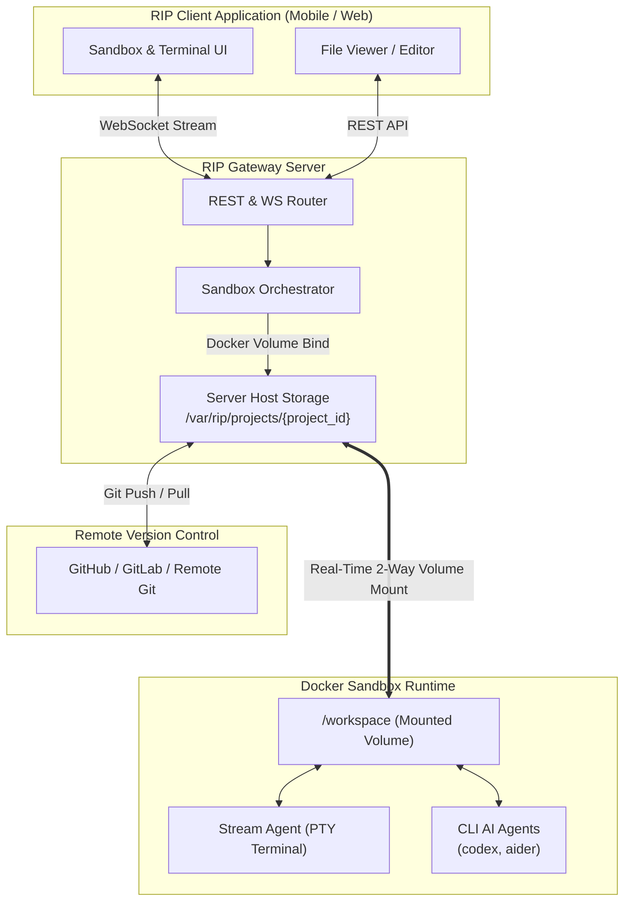

# Technical Architecture Plan: Project-Server-Docker Synchronization (`project_server_docker.md`)

## 1. Executive Overview

This document outlines the architectural plan and technical specifications for connecting user project repositories hosted on the server host directly into Docker-based execution sandboxes. 

By leveraging **Host-to-Container Volume Binding (`-v /host/project/path:/workspace`)**, the RIP application establishes a **zero-latency, two-way synchronized code environment**. Any modification made by AI agents (`codex`, `aider`), user terminal editors (`vim`, `nano`), or REST file APIs inside the sandbox instantly persists on the server host and updates the project's Git workspace.

---

## 2. System Architecture Diagram



---

## 3. Core Principles & Synchronization Model

| Component | Mechanism | Details |
|---|---|---|
| **Host Storage** | Persistent Server Path | `/var/rip/users/{user_id}/projects/{project_id}` (or local project directory in dev mode). |
| **Container Mount** | Docker Volume Bind (`mode: rw`) | Mounts host path to `/workspace` inside container. |
| **Latency** | 0ms (In-Memory OS Kernel File Operations) | File edits inside `/workspace` immediately modify host files with zero network or transfer lag. |
| **Persistence** | Container-Independent | If a container crashes, stops, or restarts, all code modifications remain 100% safe on the server disk. |
| **Git Integration** | Direct `.git` Binding | Full Git context (`.git/`) is preserved inside `/workspace`, allowing native `git commit`, `git status`, and `git push`. |

---

## 4. End-to-End Workflow Pipeline

### Step 1: Project Provisioning / Repository Connection
1. User connects a GitHub repository or uploads a project archive via the RIP application.
2. Gateway stores or clones the repository into the dedicated server project folder:
   `SERVER_PROJECT_DIR = /var/rip/projects/{user_id}/{project_id}`
3. Initial Git configuration and user credentials are tied to the directory.

### Step 2: Sandbox Container Instantiation
1. When user opens the Sandbox view in RIP app, `Orchestrator.create_sandbox(project_id, user_id, environment)` is triggered.
2. `Orchestrator` resolves `SERVER_PROJECT_DIR` and generates volume configuration:
   ```python
   volumes = {
       server_project_dir: {
           'bind': '/workspace',
           'mode': 'rw'
       }
   }
   ```
3. Docker container starts with working directory set to `/workspace` (`working_dir='/workspace'`).

### Step 3: Stream Agent & Symlink Setup
1. `_deploy_stream_agent` injects `stream_agent.py` and starts a background `/bin/bash -l` PTY session inside `/workspace`.
2. CLI AI tools (`codex`, `aider`) are auto-symlinked to `/usr/local/bin/` so they execute anywhere in `/workspace`.

### Step 4: Code Editing Execution
- **AI Agent Edit**: User executes `codex "add login route to app.py"`. Codex modifies `/workspace/app.py`. Edits instantly persist on server host.
- **Terminal Edit**: User runs `vim app.py` inside app terminal. Save action updates server host instantly.
- **GUI Editor Edit**: User edits via app editor. REST endpoint `PUT /gateway/api/sandbox/{id}/files/write` updates `/workspace/app.py`.

### Step 5: Remote Git Synchronization
- User or AI agent runs `git commit -am "Updated login route"`.
- App pushes commit back to GitHub/GitLab using user OAuth tokens.

---

## 5. Implementation Roadmap & Code Modifications

### A. Update `orchestrator.py` (Project Path Binding)
Add project path resolution to `create_sandbox` in `gateway/gateway/core/sandbox/orchestrator.py`:

```python
# In Orchestrator.create_sandbox:
project_path = self._get_project_host_path(project_id, user_id)

volumes = {
    project_path: {
        "bind": "/workspace",
        "mode": "rw"
    }
}

container = self.client.containers.run(
    image=image_name,
    detach=True,
    tty=True,
    stdin_open=True,
    working_dir="/workspace",
    volumes=volumes,
    labels=labels,
    name=container_name
)
```

### B. Add Project Path Helper in `orchestrator.py`
```python
def _get_project_host_path(self, project_id: str, user_id: str) -> str:
    # In development mode: use current workspace directory or mapped project folder
    if settings.is_dev_mode:
        return os.path.abspath(settings.default_project_dir)
    
    # In production mode: return user persistent storage path
    path = os.path.join(settings.user_projects_root, user_id, project_id)
    os.makedirs(path, exist_ok=True)
    return path
```

### C. Enhance Gateway REST API (`sandbox.py`)
Ensure sandbox status endpoint returns connected project path and Git status:
- `GET /gateway/api/sandbox/{sandbox_id}/git/status`
- `POST /gateway/api/sandbox/{sandbox_id}/git/sync`

---

## 6. Security & Resource Policy

> [!IMPORTANT]
> **Container Security Constraints**
> - **RAM Limit**: Set `--memory=2g` to prevent container out-of-memory lockups.
> - **CPU Quota**: Set `--cpus=2.0` to balance server host CPU load.
> - **User Privileges**: Run container commands under non-root developer user where applicable.
> - **File Permissions**: Set volume mount permissions (`rw`) restricted to project owner `user_id`.

---

## 7. Verification Protocol

1. **Local Test**: Run `create_sandbox` with a sample project directory. Verify files in `/workspace` inside container match local laptop project files.
2. **AI Agent Edit Test**: Run `codex --version` and execute a codex edit command. Confirm file changes immediately show on host filesystem.
3. **Container Restart Test**: Restart container via `POST /gateway/api/sandbox/{id}/restart`. Confirm all file edits remain preserved.
4. **Git State Verification**: Run `git status` inside container terminal and confirm local commits work seamlessly.
